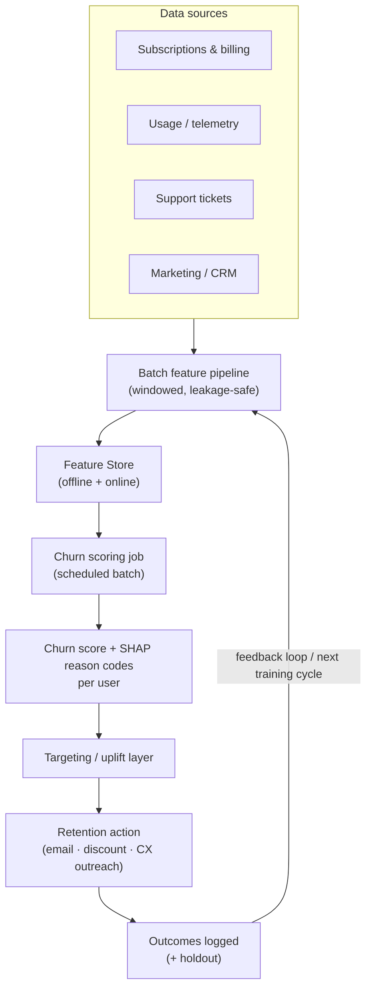
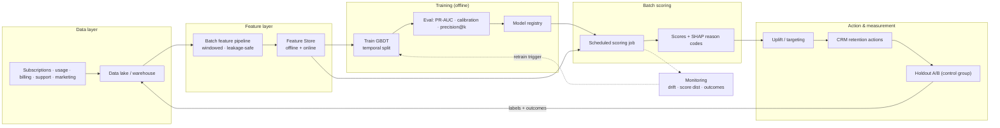

# Mock Problem 01: Predict Customer Churn for a Subscription Service

> **Archetype:** classic supervised ML (tabular) · **Difficulty:** warm-up to mid · **Great for:** showing ML fundamentals, leakage awareness, and business-metric thinking.

## The Prompt
*"Design an ML system to predict customer churn for a subscription service (think a streaming or SaaS product)."*

## 40-Minute Game Plan
| Phase | Focus | Min |
|---|---|---|
| C | Define churn, horizon, action taken on a prediction | 6 |
| H | Batch scoring pipeline + retention action layer | 7 |
| A | Labels/leakage, features, model, imbalance, eval | 13 |
| S | Feature store, scheduling, monitoring | 6 |
| E | Uplift modeling, drift, extensions | 5 |
| — | Recap | 3 |

---

## C — Clarify & Scope
Ask, don't assume:
- **What is "churn"?** Voluntary cancel vs. involuntary (failed payment)? Contractual (subscription end) vs. usage-based lapse? **Define it precisely — the label depends on it.**
- **Prediction horizon:** churn in the next 30 days? next billing cycle?
- **What action follows a prediction?** (Discount, email, CX outreach.) This sets the metric and whether we need **uplift**, not just churn probability.
- **Latency:** almost always **batch** (daily/weekly), not real-time. Confirm.
- **Scale:** users (e.g., 50M), how far back the data goes.

**Framing:** binary classification per user per period, but the real objective is **retained revenue from intervention**, so calibration and targeting matter more than raw accuracy.

**Non-functional:** batch (hours OK), interpretable enough for the retention team, refreshed on a schedule, monitored for drift.

**Tips & suggestions**
- Nail the **label definition first** — write it on the board (observation window → prediction window). This is the single most common failure point.
- Reframe the goal from "predict churn" to "**maximize retained revenue per dollar of intervention**." That reframing signals seniority.
- Give a quick scale estimate: 50M users scored weekly = trivial batch load; say so and move on rather than over-engineering.

**Expected interviewer follow-ups**
- *"Real-time or batch?"* — Batch; churn evolves over days and interventions are campaigns. Real-time only for in-session saves (e.g., a cancel-flow offer).
- *"What's the actual business objective?"* — Incremental retained revenue, not accuracy — which is why calibration + uplift matter.
- *"How much history do you need?"* — Enough to cover seasonality and tenure effects (often 12+ months) and to build multi-period training snapshots.

## H — High-Level Architecture

**Tips & suggestions**
- Draw the **feedback loop explicitly** — interviewers love that you close the training/serving cycle.
- Separate the **scoring layer** from the **action layer**; the retention team owns thresholds/budgets, you own scores.
- Call out that serving is a cheap table read for the CRM — no heavy request-time inference.

**Expected interviewer follow-ups**
- *"Where does the model actually run?"* — A scheduled batch job (Airflow/cron) writing scores to a table the CRM reads.
- *"Who consumes the output and how?"* — Retention/marketing via CRM; they need scores **plus reason codes**, so bake in explainability.
- *"How do you avoid a self-fulfilling feedback loop?"* — Log the treatment (who got an intervention) so future training can account for it; hold out a control group.

## A — AI/ML Deep Dive
**Label construction (the crux — avoid leakage):**
- Define an **observation window** (features from days t-90..t) and a **prediction window** (churn in t..t+30). Never use any signal from the prediction window as a feature.
- Classic leakage traps: "days since last login" computed *after* they churned; cancellation-flow events; a "downgrade" that is really part of the churn.

**Features:**
- **Engagement/usage:** frequency, recency, session length, feature adoption, trend (declining usage is the strongest signal).
- **Billing:** plan, tenure, price changes, failed payments, refunds.
- **Support:** ticket count, sentiment, unresolved issues.
- **Lifecycle:** tenure, onboarding completion, seasonality.

**Model:**
- Start with **gradient-boosted trees (XGBoost/LightGBM)** — strong on tabular, handles mixed features, gives feature importance. Logistic regression as an interpretable baseline.
- Neural nets only if you have rich sequences (then an RNN/transformer over the usage timeline) — usually overkill; mention as an extension.

**Class imbalance:** churn is rare (e.g., 2–5%/month). Use class weights / `scale_pos_weight`, focus on **PR-AUC**, and **do not** optimize plain accuracy.

**Evaluation:**
- Offline: **PR-AUC, ROC-AUC, precision@k** (you can only contact top-k), and **calibration** (probabilities must be trustworthy to set discount budgets).
- **Temporal split** (train on past, validate on future) — never random split, which leaks the future.
- Online/business: **retention lift, incremental revenue, campaign ROI** via holdout A/B.

**Tips & suggestions**
- Volunteer **leakage + temporal validation** before you're asked — it's a strong senior signal.
- Anchor every model choice to interpretability and calibration, not leaderboard accuracy.
- Mention **precision@k tied to contact capacity** — it shows you connect the metric to the operational constraint.

**Expected interviewer follow-ups**
- *"Why not optimize accuracy?"* — With 3% churn, "predict nobody churns" is 97% accurate and useless; use PR-AUC and precision@k.
- *"How do you prevent data leakage?"* — Strict observation/prediction windows, temporal validation, and auditing each feature's timestamp against the cutoff.
- *"Why GBTs over deep learning?"* — Tabular churn is a GBT sweet spot: strong accuracy, native mixed features, feature importance, cheap to train.
- *"How do you set the decision threshold?"* — By retention budget and the value of a save — the PR operating point that maximizes expected net revenue.
- *"Your AUC is high but retention didn't move — why?"* — Accuracy ≠ impact; you likely targeted sure-churners/sure-stayers. Switch to uplift and measure with a holdout.

## S — System & Infra Deep Dive
- **Feature store** for train/serve parity; batch materialization on a schedule (Airflow/cron).
- Batch scoring job writes scores to a table the CRM reads.
- **Monitoring:** feature drift, score-distribution shift, and label/outcome tracking; retrain cadence (monthly) or trigger on drift.

**Tips & suggestions**
- Reuse the **same feature code** for training and scoring to eliminate skew — name the feature store as the enforcement mechanism.
- Track the **score distribution over time** as a cheap early-warning for drift before labels arrive.

**Expected interviewer follow-ups**
- *"How often do you retrain?"* — Scheduled (monthly) plus drift-triggered; churn behavior shifts with pricing/seasonality.
- *"How do you detect the model is stale?"* — Feature drift + score-distribution shift now; PR-AUC/calibration once outcomes land.
- *"Training-serving skew — how do you avoid it?"* — Single feature-store definition consumed by both paths; no bespoke serving-time transforms.

## E — Extensions & Trade-offs
- **Uplift/treatment-effect modeling:** don't target users who'd churn anyway or who'd stay anyway — target the **persuadables**. Two-model or uplift trees. This is the senior-level insight.
- **Reason codes** (SHAP) so retention teams act on *why*.
- Reject-inference-style bias: interventions change future labels; log treatment to avoid a feedback loop that corrupts training.

**Tips & suggestions**
- Lead the extensions with **uplift modeling** — it's the differentiator between a junior and senior answer.
- Tie explainability (reason codes) to a concrete action the retention team takes.

**Expected interviewer follow-ups**
- *"What is uplift and why not just churn probability?"* — Uplift estimates the *causal effect of the intervention*; you spend budget only on persuadables, not on those who'd stay/leave regardless.
- *"How do you measure incremental impact?"* — Randomized holdout: compare retained revenue in treated vs. control among targeted users.
- *"How do you keep interventions from corrupting future labels?"* — Log treatment as a feature/flag, maintain a persistent control, and account for it in training.

## Final Architecture

## 60-Second Close
"Batch classification per user with carefully windowed labels to avoid leakage, GBTs on engagement/billing/support features, evaluated with PR-AUC and calibration on a temporal split, then targeted with uplift modeling and measured by incremental retained revenue via holdout. Feature store for parity, scheduled scoring, drift monitoring, monthly retrain."
