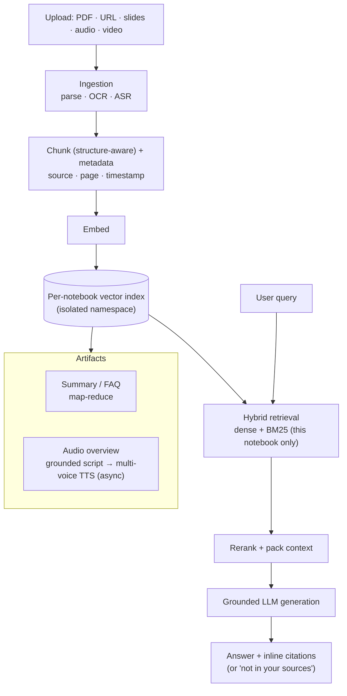
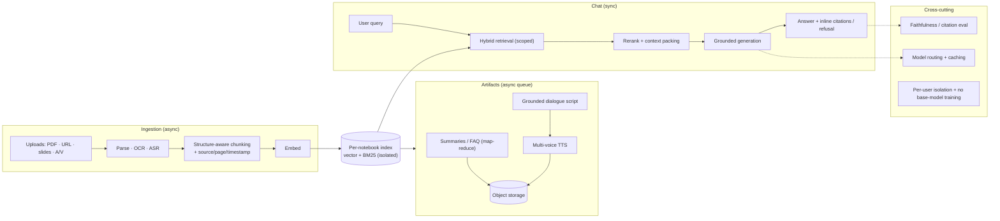

# Mock Problem 02: Design Google NotebookLM

> **Archetype:** RAG over a user-provided corpus + multimodal generation · **Difficulty:** mid–senior · **Great for:** grounding, citations, source-restricted generation, audio overview.

## The Prompt
*"Design Google NotebookLM — a tool where users upload their own sources (documents, PDFs, slides, web pages, videos) and then ask questions, get summaries, and generate artifacts (e.g., an audio 'deep dive' overview) grounded strictly in those sources."*

## 40-Minute Game Plan
| Phase | Focus | Min |
|---|---|---|
| C | Source-grounded vs. open-web; artifacts; scale | 6 |
| H | Ingest → index → RAG → generation architecture | 8 |
| A | Chunking, retrieval, grounded generation, citations, audio | 13 |
| S | Per-notebook index, serving, cost | 6 |
| E | Multimodal sources, faithfulness eval | 5 |
| — | Recap | 2 |

---

## C — Clarify & Scope
- **Core constraint:** answers must be **grounded strictly in the user's uploaded sources**, with **citations** back to the source — *not* the open web or model memory. This is the defining requirement.
- Source types: PDFs, docs, slides, pasted text, URLs, and (increasingly) **audio/video** (needs transcription).
- Artifacts: Q&A chat, summaries, FAQs, study guides, timelines, and the **audio overview** (two AI hosts discussing the sources).
- Scale of a notebook: dozens–hundreds of sources, potentially millions of tokens total → must retrieve, not stuff everything.
- Privacy: user data is private; not used to train base models (state this).

**Non-functional:** interactive latency for chat (~seconds), faithful/cited answers, per-user isolation, async for heavy artifacts (audio).

**Tips & suggestions**
- Open by naming the defining constraint: **closed-corpus, cited, no open-web** — everything else follows from it.
- Distinguish **interactive** work (chat, ~seconds) from **heavy async** artifacts (audio overview, minutes) early — it shapes the architecture.
- Raise **privacy / per-notebook isolation** unprompted; it's both a product promise and a design constraint.

**Expected interviewer follow-ups**
- *"How is this different from ChatGPT?"* — Closed-corpus RAG grounded strictly in the user's sources with citations, not open-world generation. The design is about faithfulness + isolation, not world knowledge.
- *"A notebook has 10M tokens — how do you answer?"* — Retrieve top-k relevant chunks; never stuff. Global summaries use hierarchical map-reduce.
- *"Which artifacts are synchronous vs. async?"* — Chat/summaries synchronous; audio overview (script + multi-voice TTS) is a queued async job.

## H — High-Level Architecture

**Tips & suggestions**
- Show the **isolation boundary** in the diagram (per-notebook index) — grounding and privacy both depend on it.
- Split ingestion (async, slow) from query (sync) from artifacts (queued) — three distinct latency regimes.

**Expected interviewer follow-ups**
- *"How do you keep notebooks isolated?"* — Per-notebook index namespace + access control; retrieval is scoped to the owning notebook only, never across notebooks or to the web.
- *"How do you handle audio/video sources?"* — ASR to timestamped transcripts, then treat like text; cite timestamps.
- *"Where do the citations come from?"* — Chunk metadata (source + page/timestamp) carried through retrieval into generation.

## A — AI/ML Deep Dive
**Ingestion & chunking:**
- Parse PDFs/slides preserving structure (headings, pages) for citation anchors. OCR scanned docs; **ASR** (speech-to-text) for audio/video.
- **Chunk** by semantic/structural boundaries (~200–500 tokens) with overlap; keep source + page/timestamp metadata for citations.

**Retrieval (RAG, Chapter 6):**
- Embed chunks; **hybrid retrieval** (dense embeddings + keyword/BM25) improves recall on names/terms.
- Retrieve top-k from **only this notebook's index** (strict isolation — never leak across notebooks or to the web).
- Optional rerank for precision; pack the best chunks into context within the budget.

**Grounded generation:**
- Prompt the LLM to answer **only** from provided chunks and to **cite** each claim (source + page); if the sources don't contain the answer, say so — don't hallucinate.
- **Inline citations** are a product requirement: map each sentence/claim to its supporting chunk.

**Audio overview:**
- Generate a **grounded dialogue script** (two-host conversation) from retrieved/summarized content, then **multi-speaker TTS**. Long/async job.

**Summaries over large corpora:** **map-reduce / hierarchical summarization** (summarize chunks → summarize summaries) to fit context.

**Tips & suggestions**
- Emphasize **hybrid retrieval** — pure dense misses exact names/IDs that matter in documents.
- Make **refusal a feature**: "not in your sources" beats a confident hallucination, and it's what earns user trust.
- For the audio overview, ground the **script first**, then voice it — don't let TTS be where faithfulness is checked.

**Expected interviewer follow-ups**
- *"How do you guarantee it doesn't hallucinate?"* — Retrieve from the notebook only, instruct answer-from-context-with-citations, verify claims are supported, and refuse when sources lack the answer. You reduce, not eliminate — hence citations for user verification.
- *"Dense or keyword retrieval?"* — Hybrid: dense for meaning, BM25 for exact terms/names, fused and reranked.
- *"How do you summarize a 500-page source?"* — Hierarchical map-reduce: summarize chunks, then summarize the summaries.
- *"How do you generate the audio overview faithfully?"* — Ground the script in retrieved content, evaluate the script for faithfulness, then TTS.

## S — System & Infra Deep Dive
- **Per-notebook vector index** (namespace/isolation) — critical for privacy and grounding.
- Ingestion pipeline async (parsing/OCR/ASR can be slow); chat retrieval + LLM synchronous; audio generation queued.
- **Cost levers:** cache embeddings and summaries; retrieve tightly; route models (small for retrieval/summarize, large for synthesis).
- Serving: vector DB + LLM endpoints + TTS service; store artifacts in object storage.

**Tips & suggestions**
- Name concrete **cost levers** (caching, tight retrieval, model routing) — cost control is a senior signal in LLM systems.
- Treat OCR/ASR as **idempotent, resumable** pipeline stages — big files fail and retry.

**Expected interviewer follow-ups**
- *"What's the dominant cost?"* — LLM synthesis tokens and (for audio) TTS; mitigate with caching, tight top-k, and routing small models for retrieval/summarize.
- *"How do you make ingestion robust to a huge PDF?"* — Async chunked pipeline with retries and progress; embeddings cached so re-asks don't re-embed.

## E — Extensions & Trade-offs
- **Faithfulness vs. helpfulness:** strict grounding may refuse when sources are thin — tune the refusal bar; always prefer "not in your sources" over a hallucination.
- **Multimodal grounding:** cite specific video timestamps / image regions.
- Long-source handling: hierarchical indexes; per-source summaries as a retrieval layer.
- Evaluation: **citation accuracy / faithfulness** (does each claim trace to a source?), retrieval recall, answer usefulness (human/LLM-judge).

**Tips & suggestions**
- Propose **faithfulness/citation accuracy** as the primary offline metric — it directly measures the product's core promise.
- Mention multimodal citation (timestamps/regions) as a differentiated extension.

**Expected interviewer follow-ups**
- *"How do you evaluate faithfulness?"* — Check each generated claim traces to a cited chunk (LLM-judge + human audits); measure retrieval recall and citation accuracy.
- *"What if grounding makes it refuse too often?"* — Tune the refusal threshold and improve retrieval recall; err toward honesty over coverage.
- *"Would you fine-tune per user?"* — No; RAG is the right tool. Fine-tuning per notebook is costly, stale, and unnecessary.

## Final Architecture

## 60-Second Close
"Closed-corpus RAG: ingest and OCR/ASR sources into a per-notebook, isolated vector index; answer via hybrid retrieval + grounded generation with inline citations, refusing when sources don't cover it; build summaries with hierarchical map-reduce and the audio overview as a grounded script + multi-voice TTS async job. Evaluate on citation faithfulness and retrieval recall; control cost with caching and model routing."
