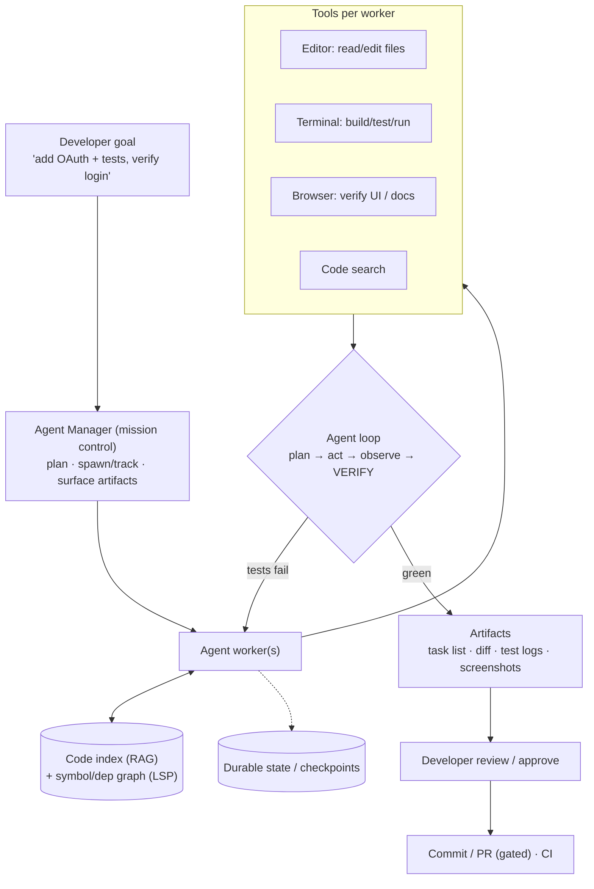
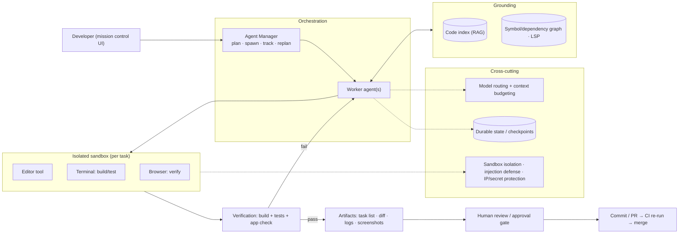

# Mock Problem 03: Design Google Antigravity (Agentic IDE / Coding Platform)

> **Archetype:** agentic coding platform · **Difficulty:** senior–staff · **Great for:** agent orchestration, tool use, verification, human control. See also Problems 15 and book Ch. 17.

## The Prompt
*"Design Google Antigravity — an agent-first development platform where AI agents autonomously plan and execute coding tasks across the editor, terminal, and browser, while the developer supervises at a higher 'mission control' level."*

> If you don't know the specific product, say so and design **"an agentic IDE where AI agents autonomously complete coding tasks across editor + terminal + browser under human supervision."** Interviewers care about your reasoning, not trivia.

## 40-Minute Game Plan
| Phase | Focus | Min |
|---|---|---|
| C | Autonomy level, surfaces (editor/terminal/browser), trust | 6 |
| H | Agent manager + workers over tools; artifacts/verification | 8 |
| A | Planning, code grounding, tool use, self-verification | 12 |
| S | Sandboxes, state, VCS/CI, cost/latency | 7 |
| E | Trust artifacts, multi-agent, safety | 5 |
| — | Recap | 2 |

---

## C — Clarify & Scope
- **Autonomy spectrum:** autocomplete → chat → *autonomous agent that plans and executes multi-step tasks*. Antigravity is the agentic end. Confirm the developer supervises rather than micromanages.
- **Surfaces the agent controls:** editor (edit files), **terminal** (run commands/tests), **browser** (verify web apps, read docs). This tri-surface control is the differentiator.
- **Trust model:** agents produce **verifiable artifacts** (task lists, plans, screenshots, test results) so the human can audit async work — "mission control" over multiple agents.
- Scale: many developers, many concurrent agent sessions, large repos.

**Non-functional:** safe execution (untrusted actions), verifiable/auditable agent work, tolerable latency (async agent tasks are minutes), cost per task, IP privacy.

**Tips & suggestions**
- Place the product on the **autonomy spectrum** out loud (autocomplete → chat → agent); it frames why verification and safety dominate.
- Emphasize the **tri-surface (editor + terminal + browser)** control — the terminal/browser are what let the agent *verify* its own work.
- Flag **untrusted execution** and **IP privacy** as first-class non-functionals now, so they don't look bolted on later.

**Expected interviewer follow-ups**
- *"How is this different from autocomplete/Copilot?"* — Autonomy: it plans and executes multi-step tasks across editor/terminal/browser and verifies results, rather than suggesting the next line.
- *"What does 'supervise' mean concretely?"* — The human reviews verifiable artifacts and approves/redirects at a mission-control layer, not keystroke-by-keystroke.
- *"What's the acceptable latency?"* — Async minutes per task; the UX is "kick off and review," not real-time typing.

## H — High-Level Architecture

**Tips & suggestions**
- Draw the **verify step inside the loop** — it's the single most important box; agents that don't verify are just code generators.
- Show artifacts flowing to a **human review gate** before any commit — never a silent write path.
- Keep the **code index + symbol graph** visible; grounding is what stops hallucinated edits.

**Expected interviewer follow-ups**
- *"How does a human supervise multiple async agents?"* — Via verifiable artifacts (task lists, diffs, test results, screenshots) at a mission-control layer; approve/redirect rather than watch keystrokes.
- *"Why give it a browser and terminal?"* — So it can run the tests it wrote and load the page it changed — self-verification is what makes autonomy trustworthy.
- *"Where does state live for a 20-minute task?"* — Durable checkpoints so sessions resume across interruptions/restarts.

## A — AI/ML Deep Dive
**Planning:** LLM decomposes the goal into steps; maintains a task list (a trust artifact). Replans on failure.

**Code grounding (Chapter 17):** RAG over the repo + **symbol/dependency graph / LSP** so the agent edits in context (finds definitions, callers, conventions) rather than guessing.

**Tool use (agent core, Chapter 7):**
- `read_file` / `edit_file`, `run_terminal` (build/tests), `browser` (navigate/verify), `search_code`.
- The **browser + terminal** let the agent *verify its own work* — run the tests it wrote, load the page it changed. This verification loop is what makes autonomous coding trustworthy.

**Self-verification (the key to precision):** the agent doesn't declare done on a hunch — it **runs tests and checks the running app**, iterating until green. Evidence (passing tests, screenshots) becomes the artifact.

**Multi-agent:** parallel agents for independent subtasks (feature vs. tests vs. docs) under the manager; use only when subtasks are separable (fan-out multiplies cost).

**Tips & suggestions**
- Frame **self-verification as the precision mechanism** — precision > raw capability for developer trust.
- Ground before you generate: locate the right files/callers via the symbol graph, then edit — call this out explicitly.
- Treat **multi-agent as a deliberate choice**, not a default; a single grounded agent often wins (Ch. 7 simplicity principle).

**Expected interviewer follow-ups**
- *"How do you stop it from breaking the codebase / hallucinating?"* — Ground in the repo (symbol graph), run tests/browser to verify before claiming done, and gate commits through review + CI.
- *"When do you use multiple agents?"* — Only for separable subtasks or role-splits; fan-out multiplies cost and risks conflicting edits.
- *"How does the agent know it's done?"* — Verifiable success: build + tests pass and the running app behaves — not plausibility.

## S — System & Infra Deep Dive
- **Sandboxed execution:** every terminal/browser action runs in an isolated, resource-limited, egress-controlled environment (agents run untrusted/generated code — see safety).
- **Durable state / checkpointing:** agent tasks run minutes and async; persist state so sessions resume and long tasks survive restarts.
- **VCS/CI integration:** changes land as commits/PRs through normal review + CI gates — never silent force-pushes.
- **Cost/latency:** model routing (small for edits/triage, large for planning), context budgeting over big repos, caching the code index.

**Tips & suggestions**
- State the sandbox properties as a checklist: **isolated, ephemeral, resource-capped, egress-controlled** — it reads as production-grade.
- Add **step/iteration caps** so a stuck agent can't burn unlimited compute.

**Expected interviewer follow-ups**
- *"Agents run generated code — isn't that dangerous?"* — Execute only in isolated, egress-controlled, resource-capped sandboxes; never against prod or with real secrets.
- *"What's the cost concern?"* — Long loops + big-repo context + tool calls are expensive; route models, budget context, cache the index, cap steps.
- *"How do changes reach the repo safely?"* — As commits/PRs through review + CI; no silent or force pushes.

## E — Extensions & Trade-offs
- **Trust artifacts** (plans, diffs, test logs, screenshots) let a human supervise *asynchronous* agents at scale — the "mission control" UX.
- **Autonomy vs. control:** gate irreversible/risky actions (prod deploys, secrets, external calls) behind human approval; auto-run reversible ones.
- **Safety:** sandbox isolation; prompt-injection defense (repo/web content is untrusted data, must not trigger privileged actions); secrets/IP protection (self-hosted models for sensitive code).
- **Evaluation:** task success (SWE-bench-style), test pass rate, human acceptance of diffs, cost-per-task, and *process* quality via the trace.

**Tips & suggestions**
- Name **prompt injection** explicitly (a README or webpage is untrusted data) — it's a favorite senior/staff probe.
- Pair every autonomy claim with a **gate** for irreversible actions; "full autonomy, no gates" fails the safety bar.

**Expected interviewer follow-ups**
- *"Prompt injection from a README or webpage?"* — Treat repo/web content as untrusted data; constrain actions; require approval for anything with side effects.
- *"How do you evaluate the platform?"* — SWE-bench-style task success, test pass rate, human diff acceptance, cost-per-task, and trace/process quality.
- *"What must always require human approval?"* — Irreversible/risky actions: prod deploys, secret access, external network calls, merges.

## Final Architecture

## 60-Second Close
"An agent manager (mission control) orchestrates worker agents that plan, then act across editor/terminal/browser grounded in a repo code index, and crucially **verify** their work by running tests and the app before producing auditable artifacts (task list, diff, screenshots). Execution is sandboxed and egress-controlled, commits go through review/CI, irreversible actions are gated, and cost is controlled with model routing and context budgets. Evaluated by task success, test pass, and human acceptance."
