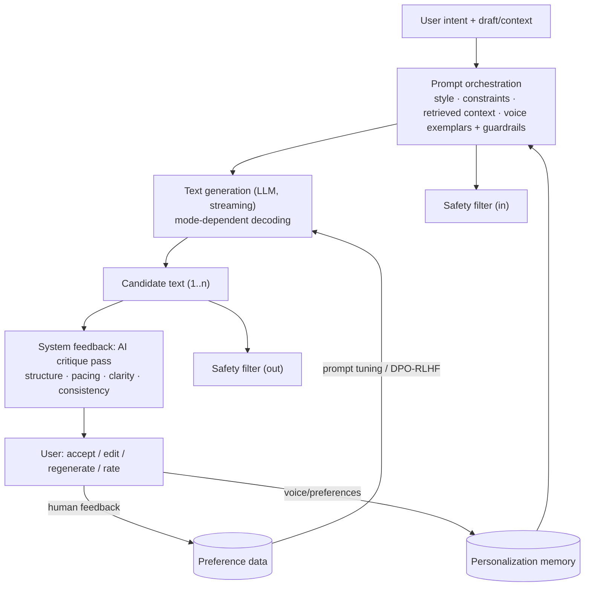
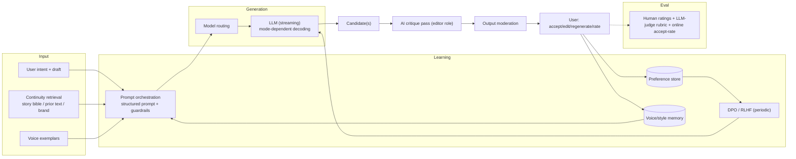

# Mock Problem 04: Generative Creative-Writing Assistant

> **Archetype:** LLM generation + feedback/quality loops · **Difficulty:** mid · **Great for:** controllable generation, evaluation of open-ended output, feedback mechanisms.

## The Prompt
*"Build a creative-writing assistant powered by generative AI. Outline the system architecture — prompt generation, text generation, and feedback mechanisms — that helps users draft, revise, and improve creative writing (stories, scripts, marketing copy)."*

## 40-Minute Game Plan
| Phase | Focus | Min |
|---|---|---|
| C | Use cases, control, quality bar, safety | 6 |
| H | Prompt orchestration → generation → feedback loop | 8 |
| A | Controllable generation, style, feedback/critique, personalization | 13 |
| S | Serving, streaming, cost, context/memory | 6 |
| E | Eval of creative output, RLHF, safety | 5 |
| — | Recap | 2 |

---

## C — Clarify & Scope
- **What kind of writing?** Fiction, screenplays, marketing copy, poetry? Each has different structure/quality signals. Assume a general assistant with drafting + revision.
- **Interaction model:** one-shot generation vs. **iterative co-writing** (draft → suggestions → revise). The latter is the interesting design; the "feedback mechanism" hint points here.
- **Control:** users want to steer tone, style, length, POV, genre — controllability matters.
- **Feedback:** (a) *user* feedback (thumbs, edits, regenerate) and (b) *system* feedback (AI critique/suggestions on the user's draft). Clarify both.
- Safety: block disallowed content; respect IP/plagiarism concerns.

**Non-functional:** low-latency **streaming** generation, controllable/diverse output, personalization to the user's voice, safe.

**Tips & suggestions**
- Anchor on **iterative co-writing**, not one-shot generation — that's where the prompt's "feedback mechanism" hint lives.
- Explicitly split **two feedback types** early: system critique (AI → user) vs. human preference (user → system). Interviewers reward this distinction.
- Mention **safety/IP** in scope so it's a designed-in constraint, not an afterthought.

**Expected interviewer follow-ups**
- *"One-shot or iterative?"* — Iterative: draft → critique → revise; the value is in the loop, not a single completion.
- *"What does the user want to control?"* — Tone, style, length, POV, genre — controllability via prompt + exemplars + decoding params.
- *"Which writing domain?"* — Clarify; each (fiction vs. marketing copy) has different structure and quality signals; design a general core with per-type templates.

## H — High-Level Architecture

**Tips & suggestions**
- Draw **generator and critic as separate boxes** — the prompt literally asks for prompt-gen, generation, and feedback as distinct components.
- Show preference data feeding **both** immediate prompt improvement and longer-term DPO/RLHF.
- Put input **and** output safety filters on the diagram.

**Expected interviewer follow-ups**
- *"Why separate the generator and critic?"* — A dedicated critique pass catches issues the generator is blind to (pacing, consistency) and yields targeted, actionable edits.
- *"What is the 'feedback mechanism' concretely?"* — System critique plus captured human accepts/edits/ratings; the latter becomes preference data.
- *"Where do guardrails sit?"* — Both input (block disallowed asks) and output (moderate generated text).

## A — AI/ML Deep Dive
**Prompt generation / orchestration:**
- Translate loose user intent into a **structured prompt**: task, genre, tone, length, POV, constraints, plus **retrieved context** (story bible, prior chapters, brand guidelines) and **few-shot exemplars** of the desired/user's style.
- Templates per writing type; inject continuity (characters, plot so far) for long works via retrieval/summary of prior text.

**Text generation:**
- Instruction-tuned LLM with **decoding controls** — temperature/top-p for creativity, length control, stop sequences. Higher temperature for ideation, lower for editing.
- **Multiple candidates** for brainstorming; let the user pick (increases perceived quality and gives preference data).

**Feedback mechanisms (the emphasized part):**
- **System feedback (AI critique):** a second pass evaluates the draft (structure, pacing, grammar, consistency) and proposes targeted edits — a critic/editor role distinct from the generator.
- **Human feedback:** captures accepts/edits/regenerations/ratings → **preference data**. Use for prompt improvement, few-shot exemplar selection, and eventually **preference tuning (DPO/RLHF)** to align to quality/taste.
- **Personalization:** learn the user's voice from their accepted text (few-shot exemplars / lightweight profile / optional fine-tune) so suggestions match their style.

**Controllability:** style/tone via system prompt + exemplars; structure via outlines-first (generate outline → expand sections) for long pieces.

**Tips & suggestions**
- Tie **decoding params to mode**: hot for ideation, cool for editing — shows you understand controllable generation.
- Reach for **prompt + exemplars + RAG before fine-tuning**; propose DPO/RLHF only once you've accumulated preference data.
- For long-form, propose **outline-first** generation and continuity retrieval — don't resend the whole manuscript.

**Expected interviewer follow-ups**
- *"How do you keep the user's voice consistent?"* — Few-shot exemplars from their accepted writing, a style profile, and continuity retrieval; optionally a lightweight per-user fine-tune.
- *"How do you handle a 300-page manuscript?"* — Outline-first generation and retrieval + summarization of prior content; never stuff the whole thing into context.
- *"How do you use the feedback data?"* — Improve prompts/exemplar selection immediately; aggregate preferences for DPO/RLHF over time.
- *"Creativity vs. safety?"* — Mode-dependent decoding + in/out moderation; ideation looser, published copy tighter.

## S — System & Infra Deep Dive
- **Streaming** token output for responsiveness; keep TTFT low.
- **Context/memory:** for long documents, retrieve + summarize prior content to stay in the window (don't resend the whole novel).
- **Cost:** model routing (small model for quick suggestions, large for full drafts); cache exemplars/summaries.
- Store drafts, versions, and preference events.

**Tips & suggestions**
- Lead serving with **streaming + low TTFT** — perceived latency is the UX in an interactive writing tool.
- Route models by task (quick suggestion vs. full draft) as the main cost lever.

**Expected interviewer follow-ups**
- *"How do you keep it responsive?"* — Token streaming, low TTFT, small models for inline suggestions.
- *"How do you manage context for long documents?"* — Retrieve + summarize prior content; outline as a persistent scaffold.
- *"What do you persist?"* — Draft versions, edits, ratings — both product history and preference-training data.

## E — Extensions & Trade-offs
- **Evaluating creative (open-ended) output** is hard: no single ground truth. Use **human ratings, LLM-as-judge rubrics** (coherence, creativity, adherence to brief, style match), engagement/accept-rate online, and A/B. Guard against LLM-judge bias.
- **Creativity vs. control vs. safety** trade-off: higher temperature = more novel but more off-brief/risky; tune per mode.
- **Safety/IP:** input+output moderation; avoid regurgitating copyrighted text; disclose AI assistance where required.
- **RLHF/DPO** on collected preferences to align to quality and the product's taste.

**Tips & suggestions**
- Tackle **evaluation of creativity head-on** — combine human ratings, rubric-based LLM-judge, and online accept-rate; don't rely on one.
- Name the **LLM-judge biases** (length/verbosity/style) you'd guard against — it signals maturity.

**Expected interviewer follow-ups**
- *"How do you evaluate quality with no ground truth?"* — Human ratings + LLM-judge rubrics offline; accept/edit/regenerate rates and A/B online. Combine; don't rely on one.
- *"How do you avoid IP/plagiarism issues?"* — In/out moderation, avoid regurgitating copyrighted text, disclose AI assistance where required.
- *"When would you actually fine-tune?"* — Only after accumulating enough preference data to justify DPO/RLHF for the product's taste, not as a default.

## Final Architecture

## 60-Second Close
"Structured prompt orchestration (intent + style + retrieved continuity + user-voice exemplars) feeds a streaming LLM with mode-dependent decoding; a separate AI critique pass gives targeted editorial feedback, while user accepts/edits/ratings become preference data for prompt improvement and eventual DPO/RLHF. Long-form uses outline-first + retrieval/summarization; quality is judged by human + LLM-judge rubrics and online accept rates; in/out moderation handles safety."
