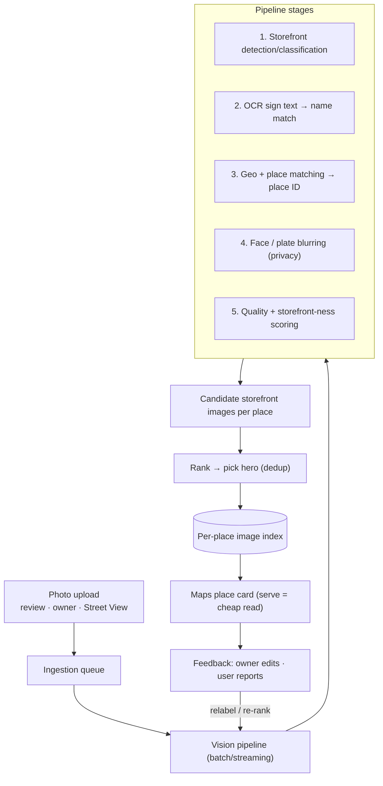

# Mock Problem 05: Storefront Image Detection in Google Maps

> **Archetype:** computer vision at scale + data pipeline · **Difficulty:** mid–senior · **Great for:** CV pipeline, quality/ranking of images, privacy, scale.

## The Prompt
*"Design a feature in Google Maps that automatically detects storefront images from user-uploaded review photos, and whenever a business adds/has a Maps entry, selects and shows the best storefront image for that business."*

## 40-Minute Game Plan
| Phase | Focus | Min |
|---|---|---|
| C | "Storefront" definition, inputs, output, scale | 6 |
| H | Ingest → detect/classify → match → rank → serve | 8 |
| A | Storefront classifier, OCR/text matching, quality ranking, privacy | 13 |
| S | Batch pipeline, index, serving, dedup | 6 |
| E | Freshness, abuse, cold start, eval | 5 |
| — | Recap | 2 |

---

## C — Clarify & Scope
- **What counts as a "storefront" image?** The exterior/entrance of the business (façade, sign) — not interior, food, or people. This is the classification target.
- **Inputs:** user-uploaded **review photos**, owner-uploaded photos, Street View. Photos are geo-tagged (approximately) and attached to a place ID (approximately).
- **Output:** for each business, **select and display the best storefront image** (one hero + maybe a few).
- **Scale:** billions of photos, tens/hundreds of millions of places; new photos continuously. Mostly **batch/near-real-time**, not per-request inference.
- **Privacy:** blur faces/license plates; respect user-content policies.

**Non-functional:** high **precision** (a wrong hero image is very visible), scalable batch pipeline, freshness, privacy-compliant.

**Tips & suggestions**
- Define "storefront" crisply (exterior + sign, not interior/food/people) — the whole labeling and classifier target hinges on it.
- Assert early that this is a **batch/near-real-time pipeline**, not request-time inference — serving is just an index read.
- Raise **face/plate blurring** unprompted; privacy is a guaranteed probe for user-photo systems.

**Expected interviewer follow-ups**
- *"Real-time or batch?"* — Batch/near-real-time ingestion; serving reads a precomputed per-place index. No request-time classification.
- *"What exactly is the label?"* — Storefront-exterior vs. interior/food/menu/people, plus which business it depicts.
- *"What's the cost of a mistake?"* — A wrong hero image is highly visible, so optimize precision and use a high confidence threshold.

## H — High-Level Architecture

**Tips & suggestions**
- Emphasize that the place card just **reads a pre-selected ranked list** — fast and cheap; all the ML happened offline.
- Show **feedback (owner edits, user reports)** looping back into re-ranking/relabeling.

**Expected interviewer follow-ups**
- *"How does the place card stay fast?"* — It reads a precomputed per-place index; no heavy model at serve time.
- *"What triggers reprocessing?"* — New/better photos, low-confidence current hero, or a model upgrade.
- *"How do owners/users influence it?"* — Owner edits and user reports feed relabeling and re-ranking as trust signals.

## A — AI/ML Deep Dive
**Storefront detection/classification:**
- **Image classifier / detector** (CNN or ViT; fine-tuned) to score "is this a storefront exterior?" and detect the façade/sign region. Multi-label (storefront vs. interior/food/menu/people).
- **OCR** to read sign text; match to the business name (strong signal that the photo is *this* store's front).

**Photo → business matching:**
- Combine **geo proximity** (photo GPS vs. place location), **OCR sign-name match**, the place the review was attached to, and **visual similarity** to known imagery. Fuse signals — GPS alone is noisy in dense areas.

**Quality & "hero" ranking:**
- Score candidates by **image quality** (sharpness, exposure, resolution), **framing** (façade centered, unobstructed), recency, and storefront-confidence. Learn a ranking model from human-rated "good hero image" labels.
- Deduplicate near-identical shots (perceptual hashing / embeddings).

**Privacy:** automatic **face and license-plate blurring** before display (detection + blur); honor takedown/report signals.

**Tips & suggestions**
- **Fuse multiple matching signals** (geo + OCR + attachment + visual) — leading with "just use GPS" is a red flag in dense malls/streets.
- Frame hero selection as a **learned ranking** over quality + framing + confidence, with **perceptual-hash dedup**.
- Reiterate **precision over recall** for the hero: showing nothing beats showing a wrong image.

**Expected interviewer follow-ups**
- *"How do you know which business a photo belongs to?"* — Fuse GPS proximity, OCR sign-name match, the attached place, and visual similarity; don't trust GPS alone.
- *"How do you pick THE image?"* — A ranking model over storefront-confidence + quality + framing + recency, deduplicated, with a high threshold for the hero.
- *"Privacy?"* — Detect and blur faces/plates before display; honor reports/takedowns; comply with content policy.

## S — System & Infra Deep Dive
- **Batch/streaming pipeline** (not request-time): process uploads asynchronously; store results in a **per-place image index**.
- At serve time, the place card just reads the pre-selected ranked images — cheap and fast.
- **Reprocessing** on new/better photos or model updates; freshness so a renovated storefront updates.
- Scale: shard by geo/place; GPU batch inference; embeddings for dedup/similarity.

**Tips & suggestions**
- Shard by **geo/place** and run **GPU batch inference**; this is a throughput problem, not a latency one.
- Prioritize reprocessing (new photos, low-confidence heroes) rather than reprocessing everything — a concrete cost lever.

**Expected interviewer follow-ups**
- *"How do you scale to billions of photos?"* — Async batch/streaming, geo/place sharding, GPU batch inference, embeddings for dedup.
- *"Freshness vs. cost?"* — Prioritized reprocessing on new photos / low-confidence heroes rather than full re-scans.

## E — Extensions & Trade-offs
- **Precision over recall:** better to show no storefront than a wrong/interior/embarrassing image. High confidence threshold for the hero.
- **Cold start:** places with only interior/food photos → fall back to Street View façade or owner upload prompt.
- **Abuse:** competitors uploading bad images; owners gaming — trust/quality signals and reporting.
- **Freshness vs. cost:** reprocessing everything is expensive; prioritize places with new photos or low-confidence current heroes.
- **Evaluation:** precision/recall of storefront classification, hero-selection agreement with human raters, OCR match rate, and user/owner report rates; privacy: blur recall.

**Tips & suggestions**
- Give a concrete **cold-start fallback** (Street View façade / owner prompt / show nothing) — don't guess.
- Propose **blur recall** as a privacy metric — a precise, testable guardrail.

**Expected interviewer follow-ups**
- *"What if there are no storefront photos?"* — Fall back to Street View façade or prompt the owner; show nothing rather than a wrong image.
- *"How do you handle abuse/gaming?"* — Trust/quality signals, reporting, and owner verification.
- *"How do you evaluate?"* — Classifier P/R, hero agreement vs. human raters, OCR match rate, blur recall, and user-report rate as an online guardrail.

## Final Architecture

```mermaid
flowchart LR
    subgraph Ingest["Ingestion"]
        SRC["Review · owner · Street View photos"]
        QUE["Ingestion queue"]
        SRC --> QUE
    end
    subgraph Vision["Vision pipeline (batch/GPU, geo-sharded)"]
        CLS["Storefront classifier/detector"]
        OCR["OCR sign text"]
        MATCH["Place matching<br/>geo + OCR + attachment + visual"]
        BLUR["Face/plate blurring"]
        SCORE["Quality + framing + confidence scoring"]
        DEDUP["Perceptual-hash dedup"]
        CLS --> OCR --> MATCH --> BLUR --> SCORE --> DEDUP
    end
    QUE --> Vision
    RANK["Hero ranking model (high precision)"]
    DEDUP --> RANK
    IDX[("Per-place image index")]
    RANK --> IDX
    CARD["Maps place card (cheap read)"]
    IDX --> CARD
    subgraph Feedback
        REP["Owner edits · user reports"]
        LAB["Relabel / retrain / re-rank"]
        REP --> LAB
    end
    CARD --> REP
    LAB -.-> Vision
    EVAL["Eval: P/R · hero agreement · OCR match · blur recall · report rate"]
    RANK -.-> EVAL
```

## 60-Second Close
"An async vision pipeline classifies uploads as storefronts, OCRs the sign, and matches each photo to a place by fusing geo + OCR name + attachment + visual similarity, blurring faces/plates for privacy. A ranking model scores storefront-confidence, quality, and framing to pick a hero image (dedup'd, high-precision) written to a per-place index that Maps reads cheaply at serve time. Reprocess for freshness; evaluate with classifier P/R, hero-agreement, and report rates."
