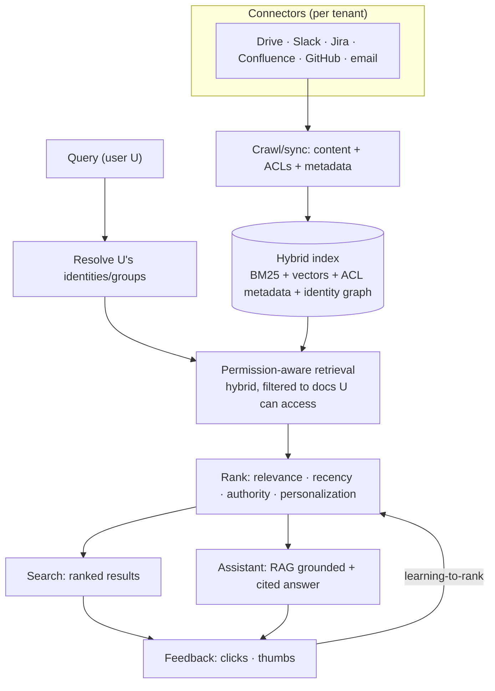
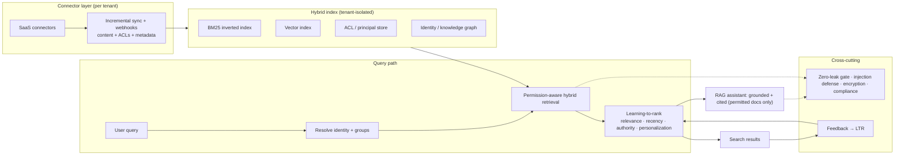

# Mock Problem 06: Design Glean (Enterprise Knowledge Search)

> **Archetype:** enterprise RAG + permission-aware retrieval · **Difficulty:** senior · **Great for:** access control, connectors, hybrid search, personalization, grounding.

## The Prompt
*"Design Glean — an enterprise knowledge search / assistant that lets employees search and ask questions across all company apps (Google Drive, Slack, Jira, Confluence, GitHub, email, etc.) with a single query, respecting each user's permissions."*

## 40-Minute Game Plan
| Phase | Focus | Min |
|---|---|---|
| C | Sources, permissions, search vs. assistant, scale | 6 |
| H | Connectors → index (+ACL) → permission-aware retrieval → RAG | 8 |
| A | Hybrid retrieval, ACL enforcement, ranking/personalization, grounded answers | 13 |
| S | Connector sync, freshness, index, serving | 6 |
| E | Knowledge graph, security, eval | 5 |
| — | Recap | 2 |

---

## C — Clarify & Scope
- **The defining constraint: permissions.** Results must respect each user's access in the *source* systems — never surface a doc a user can't see. This is what makes enterprise search hard, not the search itself.
- **Sources:** many SaaS connectors (Drive, Slack, Confluence, Jira, GitHub, email, ticketing). Heterogeneous formats and ACL models.
- **Product surface:** keyword-style **search** (ranked results) **+ assistant** (grounded, cited answers over the corpus). Assume both.
- **Scale:** thousands–hundreds of thousands of employees per tenant; millions of documents; multi-tenant SaaS.

**Non-functional:** **strict permission enforcement**, fresh (edits/new docs appear quickly), low-latency search, grounded/cited answers, tenant isolation, security/compliance.

**Tips & suggestions**
- Open with the thesis: **permissions are the entire difficulty**, not the retrieval. Say it in the first minute.
- Distinguish the **search** surface (ranked results) from the **assistant** (RAG answer) — they share retrieval but differ downstream.
- Flag **multi-tenant isolation + compliance** (SOC2, data residency) as non-functionals up front.

**Expected interviewer follow-ups**
- *"What makes enterprise search harder than web search?"* — Permissions: every result must respect per-user, per-source ACLs, and access changes constantly. Correctness here is a security property.
- *"Search, assistant, or both?"* — Both, sharing permission-aware retrieval; ranked results and a grounded cited answer.
- *"Scale?"* — Up to hundreds of thousands of employees per tenant, millions of docs, multi-tenant.

## H — High-Level Architecture

**Tips & suggestions**
- Draw the **ACL filter at the retrieval layer**, not as post-hoc hiding — this is the correctness-critical design choice.
- Store **ACLs alongside content** at crawl time; show the identity/group resolution step at query time.

**Expected interviewer follow-ups**
- *"How do you enforce permissions?"* — Crawl and store ACLs with content; at query time resolve the user's identity/groups and filter retrieval to accessible docs at the index layer.
- *"Why filter at retrieval and not after?"* — Post-filtering risks leaks and distorts ranking (you might return zero of k); enforce at the index.
- *"How do you handle heterogeneous ACL models?"* — Normalize each source's ACL into a common principal/group model in the index.

## A — AI/ML Deep Dive
**Ingestion & indexing:**
- Connectors crawl content **and permissions** (who can access each doc, via user/group/role). Store ACLs alongside content. Parse many formats.
- Build a **hybrid index**: inverted index (BM25) for exact/keyword + **embeddings** for semantic search. Optional **enterprise knowledge/identity graph** (people, teams, docs, relationships) for context and ranking.

**Permission-aware retrieval (the crux):**
- At query time, resolve the user's identity + group memberships, then **filter retrieval to only documents that user can access** — enforced at the index/retrieval layer, not by post-hoc hiding.
- ACLs change constantly (someone loses access) → permissions must be **fresh**; prefer checking current ACLs / short TTLs to avoid leaking revoked docs. This is a security-critical correctness property.

**Ranking & personalization:**
- Rank by semantic + lexical relevance, **recency**, **authority/source signals**, and **personalization** (the user's team, recent activity, collaborators) — a marketing doc matters more to sales, code to engineers.
- Learning-to-rank on click/engagement feedback.

**Grounded assistant (RAG):**
- Retrieve permitted top-k → LLM answers grounded in them with **citations** to source docs; refuse/hedge when the corpus lacks the answer. Never use content the user can't access, even in synthesis.

**Tips & suggestions**
- Stress **ACL freshness** — a cached stale ACL that surfaces a revoked doc is a security incident; favor live/short-TTL checks.
- Argue for **hybrid retrieval**: BM25 nails names/IDs/error codes, dense captures meaning.
- Note the assistant must never synthesize from docs the user can't see — permissions apply to synthesis too.

**Expected interviewer follow-ups**
- *"Keyword or semantic search?"* — Hybrid: BM25 for exact terms/names + embeddings for meaning, fused and reranked.
- *"How do you keep ACLs fresh?"* — Incremental sync + webhooks; short-TTL or live permission checks so revocations are honored quickly.
- *"How do you rank across totally different sources?"* — Normalize signals; combine relevance + recency + authority + personalization via learning-to-rank on engagement.
- *"How does the assistant avoid leaking or hallucinating?"* — RAG over the user's permitted docs only, with citations, refusing when unsupported; retrieved content is untrusted (injection defense).

## S — System & Infra Deep Dive
- **Connector sync:** incremental crawls + webhooks for freshness; backfill + delta updates; handle rate limits per SaaS API.
- **Multi-tenant isolation:** strict per-tenant index separation; encryption; compliance (SOC2, data residency).
- **Serving:** low-latency hybrid retrieval + rerank; assistant answers async-ish (seconds); cache where safe (but re-check permissions).
- Scale: shard indexes per tenant; embedding + vector store + inverted index.

**Tips & suggestions**
- Call out **per-SaaS rate limits** and incremental/webhook sync — a realistic connector concern most candidates miss.
- If you cache results, **re-check permissions on read** — caching must never bypass ACLs.

**Expected interviewer follow-ups**
- *"How do you keep it fresh?"* — Incremental sync + webhooks per connector; propagate edits and ACL changes quickly.
- *"How do you isolate tenants?"* — Separate per-tenant indexes, encryption, data-residency compliance.
- *"Can you cache for latency?"* — Yes for content/embeddings, but re-validate permissions on every read.

## E — Extensions & Trade-offs
- **Freshness vs. cost of permission checks:** caching ACLs risks leaking revoked access; favor correctness (live/short-TTL checks) for security.
- **Knowledge graph** boosts ranking and "who knows X" people-search.
- **Security:** the worst failure is **leaking a document across permission boundaries** — design and test for it explicitly; prompt-injection defense in the assistant (a retrieved doc must not manipulate answers/actions).
- **Evaluation:** search relevance (NDCG, click-through), **permission-correctness (zero unauthorized results — a hard gate)**, answer faithfulness/citation accuracy, and coverage across connectors.

**Tips & suggestions**
- Declare **"zero unauthorized results" as a hard eval gate** — not a metric to trade off. This is the line that impresses.
- Mention the **identity/knowledge graph** as both a ranking booster and an expertise-finder feature.

**Expected interviewer follow-ups**
- *"What's the worst-case failure?"* — Leaking a doc across permission boundaries; design and red-team for it; treat zero-leak as a hard gate.
- *"How do you evaluate?"* — NDCG/CTR for relevance, a zero-unauthorized-leak gate, and answer faithfulness/citation accuracy.
- *"Prompt injection in the assistant?"* — Treat retrieved docs as untrusted data that must not manipulate answers or trigger actions.

## Final Architecture

## 60-Second Close
"Connectors crawl content + ACLs per tenant into a hybrid (BM25 + vector) index with an identity graph. Queries resolve the user's identities and retrieve only permitted docs (permissions enforced at the index layer with fresh ACLs), ranked by relevance/recency/authority/personalization; the assistant answers via RAG grounded in permitted docs with citations. The design is dominated by strict, fresh permission enforcement and multi-tenant isolation, evaluated by NDCG plus a zero-unauthorized-leak gate and answer faithfulness."
