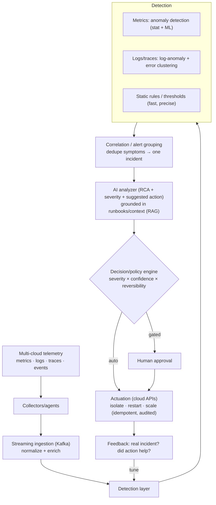
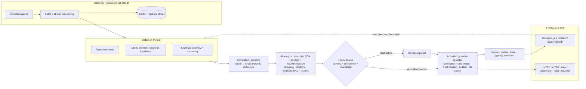

# Mock Problem 07: AI-Assisted Monitoring & Auto-Remediation Service

> **Archetype:** AIOps / anomaly detection + agentic remediation · **Difficulty:** senior–staff · **Great for:** telemetry pipelines, anomaly detection, safe automated actions, noisy alerts.

## The Prompt
*"Design a service that monitors cloud applications across multiple providers, collects telemetry (metrics, logs, traces, events), uses an AI analyzer to detect incidents, and automatically takes actions (e.g., shut down or network-isolate instances). It must work at scale and be resilient to noisy alerts."*

## 40-Minute Game Plan
| Phase | Focus | Min |
|---|---|---|
| C | What incidents, what actions, autonomy, blast radius | 6 |
| H | Ingest → detect → correlate → decide → act pipeline | 8 |
| A | Anomaly detection, correlation/RCA, noise suppression, action policy | 12 |
| S | Telemetry scale, streaming, safe actuation | 7 |
| E | Feedback, safety/guardrails, eval | 5 |
| — | Recap | 2 |

---

## C — Clarify & Scope
- **What incidents?** Availability (crash loops, latency spikes), resource (CPU/mem/disk), security (compromised instance), cost anomalies? Assume reliability + security incidents.
- **What actions, and how autonomous?** Auto-actions like **shutdown / network-isolate** are **destructive and irreversible-ish** → the central tension is *automation vs. blast radius*. Clarify which actions are auto vs. approval-gated.
- **Scale:** thousands of instances across AWS/GCP/Azure; high-volume telemetry (millions of metrics/sec, huge log/trace volume).
- **Noise:** must be **resilient to noisy alerts** — alert storms, flapping, correlated symptoms of one root cause.

**Non-functional:** real-time/near-real-time detection, high **precision** on auto-actions (a false shutdown is an outage), low MTTD/MTTR, multi-cloud, auditable.

**Tips & suggestions**
- Name the core tension in the first minute: **automation vs. blast radius**. A false destructive action is itself an outage.
- Ask which actions are **reversible** — that single axis drives the whole action-policy design.
- Foreground **noise resilience** since the prompt explicitly calls it out.

**Expected interviewer follow-ups**
- *"When is an action automatic vs. approved?"* — By severity × confidence × reversibility: reversible/low-risk auto; destructive (shutdown/isolate prod) gated on human approval unless extremely confident and contained.
- *"What incidents are in scope?"* — Reliability (latency/crash/resource) and security (compromised instance); confirm cost anomalies in/out.
- *"What's the precision requirement on auto-actions?"* — Very high — a false auto-shutdown causes the very outage you're trying to prevent.

## H — High-Level Architecture

**Tips & suggestions**
- Put **correlation/grouping between detection and decision** — collapsing a storm into one incident is the noise-resilience mechanism.
- Show the **policy engine** as an explicit gate that routes to auto vs. human approval.
- Draw actuation with the words **idempotent + audited** — safety belongs in the diagram.

**Expected interviewer follow-ups**
- *"How do you avoid acting on noisy/false alerts?"* — Hybrid detection + alert correlation into single incidents, debounce/hysteresis for flapping, severity×confidence gating, and blast-radius caps + circuit breakers.
- *"How does the AI analyzer do RCA?"* — Correlate signals, then an LLM/agent reasons over the incident + topology + recent deploys + runbooks (RAG) + past incidents to hypothesize a root cause and recommend an action.
- *"How do you handle multi-cloud?"* — Normalize telemetry and abstract actions behind a provider-agnostic interface.

## A — AI/ML Deep Dive
**Detection (hybrid, like fraud/moderation):**
- **Rules/thresholds** for known conditions — fast, precise, no cold start.
- **Anomaly detection** on metrics: forecasting/residuals (e.g., seasonal baselines), density/isolation methods; per-series baselines (each service is different). Handle seasonality (traffic is diurnal).
- **Log/trace anomalies:** log templating + clustering, error-rate spikes, trace latency anomalies.

**Noise resilience (the emphasized requirement):**
- **Alert correlation/grouping:** one root cause fans out into many alerts — group by topology/time/service dependency into a **single incident** (deduplicate symptoms). Suppress flapping with hysteresis/debounce.
- Prioritize by severity × confidence; **do not** page/act on every raw signal.

**AI analyzer (RCA + recommendation):**
- LLM/agent that ingests the correlated incident + context (recent deploys, topology, **runbooks via RAG**, past incidents) to produce **root-cause hypothesis, severity, and a recommended action** with reasoning. Grounds in real telemetry/runbooks, not guesses.

**Action policy:** map (severity × confidence × reversibility) → action tier:
- Low risk/high confidence & reversible (restart, scale) → **auto**.
- Destructive/irreversible (shutdown, isolate prod) → **human approval** unless very high confidence + contained blast radius (e.g., isolate a clearly compromised instance).

**Tips & suggestions**
- Insist on **per-series baselines + seasonality** — a global threshold floods you with false anomalies on diurnal traffic.
- Frame the AI analyzer as **grounded RCA (runbooks + topology + deploys)**, not a free-associating LLM.
- Present the action policy as an explicit **severity × confidence × reversibility** matrix.

**Expected interviewer follow-ups**
- *"Why hybrid rules + ML?"* — Rules are fast/precise/no-cold-start for known conditions; ML/anomaly catches the unknown; the LLM does RCA and recommendation.
- *"How do you handle seasonality?"* — Per-series seasonal baselines and residual-based anomaly detection, not static global thresholds.
- *"How does the analyzer avoid hallucinating a root cause?"* — Ground it in real telemetry, topology, recent deploys, and runbooks (RAG); output a hypothesis with evidence, not a guess.

## S — System & Infra Deep Dive
- **Streaming pipeline:** collectors → Kafka → stream processing for real-time detection; time-series DB for metrics, log/trace stores.
- **Multi-cloud abstraction:** provider-agnostic action interface over AWS/GCP/Azure APIs.
- **Safe actuation:** actions are **idempotent**, **rate-limited/circuit-broken** (prevent an auto-remediator from mass-killing instances during a bad detection), fully **audited**, and **reversible where possible** (isolate before terminate).
- Scale horizontally per tenant/region; backpressure on telemetry floods.

**Tips & suggestions**
- Give the actuation-safety checklist as a set: **idempotent, rate-limited, circuit-broken, blast-radius-capped, audited, reversible, kill-switch**.
- Note **backpressure** for telemetry floods — during an incident, telemetry spikes exactly when you need the pipeline most.

**Expected interviewer follow-ups**
- *"What if the auto-remediator itself causes an outage?"* — Rate limits, blast-radius caps, canarying, idempotency, a kill-switch, and audit — assume the detector can be wrong.
- *"How do you scale telemetry ingestion?"* — Streaming (Kafka) + stream processing, TSDB for metrics, sampling for expensive analysis, backpressure.
- *"Prefer isolate or terminate?"* — Reversible first (isolate/restart) before irreversible (terminate); prefer the least destructive effective action.

## E — Extensions & Trade-offs
- **Blast-radius controls:** caps on how many instances an automated action can touch per window; kill-switch; canary the remediation.
- **Human-in-the-loop:** approval gates for destructive actions; the AI proposes, humans confirm for high-impact cases (like the money-action gates in agentic systems).
- **Feedback loop:** confirmed incidents and action outcomes retrain detectors and tune thresholds; track false-action rate.
- **Safety:** the scariest failure is an **automated destructive action on a false positive** — precision, blast-radius caps, reversibility, and circuit breakers are non-negotiable.
- **Evaluation:** MTTD, MTTR, detection precision/recall, **false-action rate (critical)**, alert-noise reduction ratio, and incidents auto-resolved without human.

**Tips & suggestions**
- Make **false-action rate** the headline metric alongside MTTD/MTTR — it captures the automation-vs-blast-radius tension.
- Propose **canarying the remediation itself** — apply to one instance, verify recovery, then widen.

**Expected interviewer follow-ups**
- *"How do you evaluate success?"* — MTTD/MTTR down, detection P/R, and above all a low false-action rate; plus noise-reduction ratio and % auto-resolved.
- *"How do you get labels for tuning?"* — Confirmed incidents and action outcomes (did it help?) feed detector retraining and threshold tuning.
- *"Fully autonomous shutdowns on raw alerts?"* — No — correlate, gate destructive actions, cap blast radius, keep a kill-switch.

## Final Architecture

## 60-Second Close
"Stream multi-cloud telemetry through hybrid detection (rules + metric/log anomaly), correlate symptoms into single incidents to kill noise, then an AI analyzer does grounded RCA (topology + deploys + runbooks) and recommends an action. A policy engine gates by severity × confidence × reversibility — auto for reversible/low-risk, human approval for destructive — and actuation is idempotent, rate-limited, blast-radius-capped, reversible, and audited with a kill-switch. Success is measured by MTTD/MTTR and, critically, a low false-action rate."
