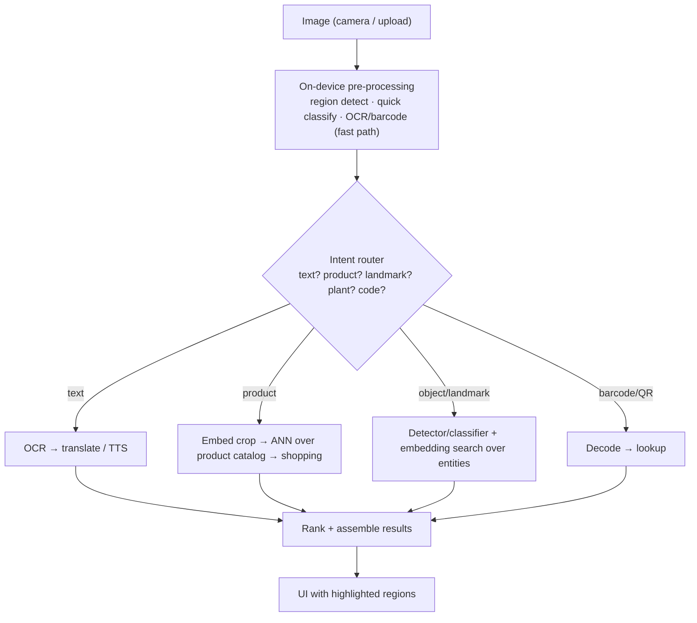
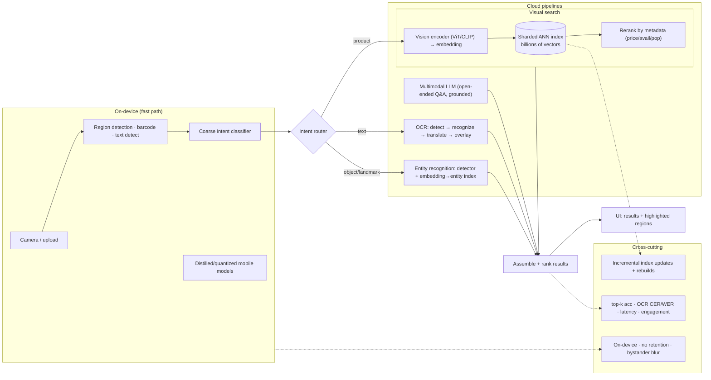

# Mock Problem 08: Design Google Lens

> **Archetype:** visual search & recognition (multimodal) · **Difficulty:** senior · **Great for:** embeddings + ANN, multi-task CV, OCR, on-device/cloud split. See also book Ch. 14.

## The Prompt
*"Design Google Lens — point your camera (or upload an image) and get useful results: identify objects/landmarks/plants, read and translate text, find visually similar products to shop, scan QR/barcodes, etc."*

## 40-Minute Game Plan
| Phase | Focus | Min |
|---|---|---|
| C | Which capabilities, on-device vs cloud, latency | 6 |
| H | Intent routing → specialized pipelines → results | 8 |
| A | Embeddings + ANN visual search, OCR, detection, on-device | 13 |
| S | Index scale, serving, latency | 6 |
| E | Freshness, multimodal LLM, eval, privacy | 5 |
| — | Recap | 2 |

---

## C — Clarify & Scope
- **Which capabilities?** Lens is a **multi-task router**: object/landmark/plant recognition, **text (OCR) + translation**, **visual product search (shopping)**, barcode/QR, homework/solve. Prioritize a couple (visual product search + OCR/translate are the meatiest) and mention the router.
- **On-device vs. cloud:** phone camera; some tasks run **on-device** for latency/privacy (text detection, barcode), heavier recognition/search in the **cloud**. Clarify the split.
- **Latency:** interactive (sub-second to a couple seconds); users point and expect instant results.
- Scale: billions of catalog/reference images for visual search.

**Non-functional:** low latency, high precision on recognition, huge visual index, privacy (camera data), works across many object domains.

**Tips & suggestions**
- Frame Lens as a **multi-task router**, then pick 1–2 pipelines to go deep on (visual product search + OCR/translate) — don't try to design all six.
- Establish the **on-device/cloud split** as a scoping decision, not an afterthought — it recurs in every phase.
- Give the scale anchor (**billions of reference images**) so the index design later feels motivated.

**Expected interviewer follow-ups**
- *"Which capabilities will you design?"* — The router plus visual product search and OCR/translate (the meatiest); mention barcode/landmark as lighter pipelines.
- *"What runs on-device vs. cloud?"* — On-device: text/region detection, barcode, coarse routing (latency + privacy). Cloud: large-index visual search and heavy recognition.
- *"What's the latency target?"* — Interactive, sub-second to ~2s; use an on-device fast path to hide cloud round-trips.

## H — High-Level Architecture

**Tips & suggestions**
- Show **multiple pipelines can run at once** (text + object) — Lens often overlays several result types.
- Keep the **fast on-device path** visible so latency and privacy are designed in, not bolted on.

**Expected interviewer follow-ups**
- *"How does the router decide?"* — A fast (often on-device) classifier picks the dominant intent(s) and routes; several pipelines can fire together.
- *"How do results get back with regions highlighted?"* — Detection returns bounding regions; the UI overlays results (e.g., AR translation replaces text in place).

## A — AI/ML Deep Dive
**Intent routing:** a fast classifier (often on-device) decides the dominant content/intent and routes to the right pipeline; multiple can run (text + object).

**Visual (product/object) search — the core:**
- **Embed** the query image (crop the region of interest) with a vision encoder (CNN/ViT, or CLIP-style image–text model) into a vector.
- **ANN search** (HNSW/IVF-PQ) over a huge index of catalog/reference image embeddings → nearest neighbors = visually similar products/objects.
- Rerank by metadata (price, availability, popularity) for shopping. **CLIP-style** models enable text+image queries and open-vocabulary recognition.

**OCR + translation:**
- **Text detection** (find text regions) → **recognition** (read characters) → optional **translation** → overlay/replace text in the image (AR translate). Detection can be on-device.

**Object/landmark/plant recognition:** detectors + fine-grained classifiers, or embedding search against a labeled entity index (scales better to millions of classes than a fixed softmax).

**On-device vs. cloud split:** on-device for latency/privacy on light tasks (barcode, text detection, coarse classification); cloud for large-index search and heavy models. Use **quantized/distilled** mobile models (MobileNet/efficient ViT) on-device.

**Tips & suggestions**
- Make **embeddings + ANN** the centerpiece for search/recognition — and explicitly reject the "one giant fixed-class classifier" approach.
- Bring up **CLIP-style** models for open-vocabulary and text+image queries; it shows modern CV awareness.
- For OCR, describe the **detect → recognize → translate → overlay** sub-pipeline concretely.

**Expected interviewer follow-ups**
- *"How does visual product search work?"* — Embed the query crop with a vision encoder, ANN-search over catalog embeddings, rerank with metadata. Embeddings + ANN, not a classifier over products.
- *"Classifier or embedding search for recognition?"* — Embedding + entity-index search scales to millions of open-vocabulary classes and adds new items without retraining a fixed softmax.
- *"How do you hit sub-second latency over billions of images?"* — Approximate NN (HNSW/IVF-PQ), sharded index, on-device fast path to hide round-trips.

## S — System & Infra Deep Dive
- **ANN index at scale:** billions of embeddings, sharded; approximate search for sub-second latency; periodic rebuilds + incremental updates for catalog freshness.
- **Serving:** on-device inference + cloud GPU inference for embeddings/heavy models; region highlighting sent back with results.
- **Latency budget:** on-device fast path masks cloud round-trip; stream partial results.
- **Cost:** embed once and cache; batch cloud inference.

**Tips & suggestions**
- Talk about **index sharding + incremental updates** — a billion-vector index can't be rebuilt from scratch constantly.
- "**Embed once, cache**" is the key cost lever for catalog-scale visual search.

**Expected interviewer follow-ups**
- *"How do you keep the catalog fresh?"* — Incremental embedding updates + periodic index rebuilds; open-vocabulary embeddings avoid retraining for new items.
- *"How do you manage cost at this scale?"* — Embed once and cache catalog vectors, batch cloud inference, push light tasks on-device.

## E — Extensions & Trade-offs
- **Multimodal LLMs** (Gemini-style) increasingly answer open-ended "what am I looking at / how do I fix this?" queries — fuse visual understanding with generation (grounded, cited where possible).
- **Freshness:** new products/landmarks require index updates; embedding search + entity index handle open-vocabulary better than fixed classes.
- **Privacy:** camera imagery is sensitive — on-device where feasible, don't retain, blur bystanders/faces.
- **Accuracy vs. latency vs. on-device size:** distillation/quantization trade accuracy for speed/footprint.
- **Evaluation:** top-k retrieval accuracy (visual search), OCR CER/WER, translation quality, recognition precision, end-to-end latency, and user engagement (click/shop).

**Tips & suggestions**
- Position **multimodal LLMs** as the extension for open-ended visual Q&A, grounded on recognized entities — not a replacement for retrieval.
- Raise **camera privacy** (on-device, no retention, bystander blur) unprompted.

**Expected interviewer follow-ups**
- *"Where do multimodal LLMs fit?"* — For open-ended visual Q&A and reasoning on top of retrieval/recognition; ground answers in recognized entities.
- *"Privacy concerns?"* — Camera imagery is sensitive; prefer on-device, avoid retention, blur bystanders/faces.
- *"How do you evaluate the whole thing?"* — Top-k retrieval accuracy, OCR CER/WER, translation quality, recognition precision, latency, and engagement.

## Final Architecture

## 60-Second Close
"An intent router (largely on-device) sends the image to specialized pipelines. The core visual search embeds the query crop with a CLIP/ViT encoder and does sharded ANN search over billions of catalog embeddings, reranked by metadata; OCR does detection→recognition→translation with on-device fast paths; recognition uses embedding + entity-index search for open-vocabulary scale. On-device distilled models handle latency/privacy-sensitive tasks, cloud handles heavy search, and multimodal LLMs extend it to open-ended visual Q&A. Evaluate with top-k accuracy, OCR error rate, and latency."
