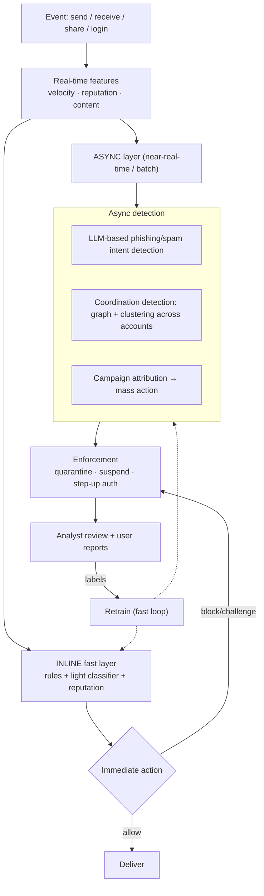
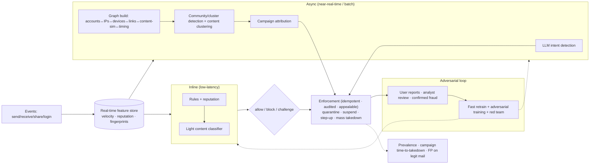

# Mock Problem 09: Real-Time Fraud & Coordinated-Bot Attack Defense for Google Workspace

> **Archetype:** adversarial abuse detection at scale · **Difficulty:** staff · **Great for:** adversarial ML, graph/coordination detection, real-time + async, asymmetric costs. See also book Chs. 11–12.

## The Prompt
*"Design an adversarial defense system that detects coordinated, LLM-generated phishing, spam, and fraud campaigns across millions of active Google Workspace accounts simultaneously — in real time."*

## 40-Minute Game Plan
| Phase | Focus | Min |
|---|---|---|
| C | Threats, surfaces, action, adversarial nature | 6 |
| H | Real-time filters + async coordination/graph detection | 8 |
| A | Content models, coordination/graph detection, adversarial robustness | 12 |
| S | Streaming scale, features, actioning | 7 |
| E | Feedback, evasion arms race, eval | 5 |
| — | Recap | 2 |

---

## C — Clarify & Scope
- **Threats:** phishing, spam, fraud — now **LLM-generated** (fluent, varied, hard for keyword filters) and **coordinated** (botnets, compromised accounts acting in concert). Two distinct problems: *content* (is this message malicious?) and *coordination* (is this a campaign?).
- **Surfaces:** Gmail (send/receive), Drive sharing, account signups/logins. Assume email + account behavior.
- **Action:** block/quarantine message, challenge/suspend account, rate-limit — with asymmetric costs (blocking a CEO's real email vs. missing phishing).
- **Adversarial:** attackers adapt continuously → the system must too. This is the defining property.
- **Scale:** millions of accounts, billions of messages/day, **real-time** decisions.

**Non-functional:** low-latency inline decisions, extreme scale, **adversarially robust**, asymmetric-cost-aware, auditable, privacy-preserving.

**Tips & suggestions**
- Split the problem into **content** (is this message bad?) vs. **coordination** (is this a campaign?) in the first minute — the coordination angle is the distinctive skill here.
- Name the **adversarial arms race** as the defining property; static classifiers decay fast.
- Frame actions as **asymmetric-cost** (a blocked real CEO email is very costly) — motivates tiered actions later.

**Expected interviewer follow-ups**
- *"LLM-generated phishing evades keyword filters — how do you catch it?"* — Rely on hard-to-forge signals (infrastructure, behavior, coordination graph) plus LLM-based intent detection; content text is cheap to vary.
- *"What surfaces and actions?"* — Gmail send/receive, Drive sharing, signups/logins; tiered actions from warn/challenge to quarantine/suspend.
- *"Why is this adversarial and why does it matter?"* — Attackers probe and adapt, so the system needs fast retraining and hard-to-forge features, not a frozen model.

## H — High-Level Architecture

**Tips & suggestions**
- Center the design on the **two-speed architecture**: inline (low-latency per message) + async (cross-account coordination). This is the key structural insight.
- Show **campaign attribution → mass action** — acting on a whole cluster at once beats one-by-one.

**Expected interviewer follow-ups**
- *"Real-time at millions of accounts — how?"* — Two-speed: inline lightweight per-message decisions + async graph/coordination detection with cross-account context; streaming infra, real-time feature store.
- *"Why can't the inline layer catch coordination?"* — Coordination is a cross-account, cross-time signal; the inline path only sees one message and must stay fast.
- *"How do you act on a whole campaign?"* — Attribute messages/accounts to a cluster, then enforce on the cluster in one operation.

## A — AI/ML Deep Dive
**Content detection (message-level):**
- Fast, cheap classifier inline (embeddings + gradient boosting / small transformer) for latency.
- Heavier **LLM-based detectors** async to catch fluent LLM-generated phishing that evades keyword/rule filters — reason over intent (credential harvesting, urgency, spoofed brand), links, and attachments.
- **URL/attachment analysis**, sender reputation, SPF/DKIM/DMARC signals.

**Coordination / campaign detection (the hard, distinctive part):**
- Individual bad messages are easy to miss; **coordination is the signal.** Build a **graph** (accounts ↔ IPs ↔ devices ↔ links ↔ content-similarity ↔ timing) and detect dense/synchronized clusters.
- **Content clustering** (near-duplicate / embedding similarity) surfaces the same campaign paraphrased by an LLM across thousands of accounts.
- **Behavioral anomaly / velocity**: bursty sends, synchronized signups, shared infrastructure. Graph ML / community detection + temporal patterns.
- **Attribution → mass action:** once a campaign cluster is identified, act on the whole cluster at once (far more effective than one-by-one).

**Adversarial robustness (the arms race):**
- Assume attackers probe and adapt (paraphrase with LLMs, rotate IPs/domains). Favor **hard-to-forge signals** (infrastructure, behavior, coordination) over easily-changed content text.
- **Fast label/retrain loop**; red-teaming; ensembles; don't expose exact thresholds. Concept drift is constant.

**Asymmetric costs (Ch. 11/12):** tune thresholds by harm — aggressive on high-confidence coordinated fraud, conservative where a false positive blocks legitimate critical mail; use **tiered actions** (warn/challenge/quarantine/suspend) rather than binary block.

**Tips & suggestions**
- Emphasize **hard-to-forge signals** (infra/behavior/coordination) — content text is the *cheapest* thing for an LLM-armed attacker to vary.
- Describe the **graph explicitly** (accounts ↔ IPs ↔ devices ↔ links ↔ content-sim ↔ timing) and community detection — the concrete coordination mechanism.
- Use **tiered actions**, not binary block, to manage asymmetric costs.

**Expected interviewer follow-ups**
- *"How do you detect coordination?"* — Graph over accounts/IPs/devices/links + content-similarity clustering + synchronized timing; detect dense/bursty clusters.
- *"How do you handle the adversarial arms race?"* — Fast retrain loop, adversarial training, ensembles, red teaming, drift monitoring, and don't leak thresholds.
- *"False positives?"* — Asymmetric-cost thresholds + tiered actions (challenge before suspend) + appeals; blocking legitimate critical mail is very costly.
- *"How do you get labels?"* — User reports, analyst review, confirmed downstream fraud — delayed and biased, so combine and reweight.

## S — System & Infra Deep Dive
- **Two-speed architecture:** inline low-latency layer for per-message decisions + async/streaming layer for graph/coordination that needs cross-account context.
- **Real-time features:** velocity counters, reputation, device/IP fingerprints via a low-latency feature store; graph features computed in near-real-time.
- **Scale:** streaming (Kafka + stream processing), sharding, sampling for expensive graph computation; privacy-preserving handling of content.
- **Enforcement service:** idempotent, auditable, reversible (false-positive appeals).

**Tips & suggestions**
- Point out that **graph computation is expensive** — do it async/near-real-time with sampling, not inline.
- Make enforcement **reversible with appeals** — false positives are inevitable at this scale and asymmetric cost.

**Expected interviewer follow-ups**
- *"What features power the inline layer?"* — Velocity counters, sender/IP/device reputation, lightweight content signals from a low-latency feature store.
- *"How do you compute graph features at scale?"* — Near-real-time streaming with sampling and windowing; full graph analytics in async batch.
- *"Privacy of scanning content?"* — Minimize, prefer on-signal/metadata features, comply with regulation.

## E — Extensions & Trade-offs
- **Evasion arms race:** static models decay fast → continuous retraining, adversarial training, human red teams, and monitoring evasion.
- **Feedback:** user "report phishing," analyst decisions, and downstream fraud confirmations → labels (delayed/biased — handle like fraud labels).
- **Privacy:** scanning content raises privacy/regulatory concerns — minimize, use on-signal features, comply.
- **Coordinated defense > per-message:** emphasize that catching the *campaign* beats chasing individual messages.
- **Evaluation:** precision/recall on labeled abuse (with asymmetric weighting), campaign detection rate + time-to-takedown, false-positive rate on legit mail, and prevalence of abuse reaching users (the north-star guardrail).

**Tips & suggestions**
- Propose **prevalence of abuse reaching users** and **campaign time-to-takedown** as north-star metrics — they capture what actually matters.
- Reiterate: **catching the campaign > chasing individual messages** — the senior framing for this problem.

**Expected interviewer follow-ups**
- *"How do you evaluate?"* — Precision/recall (asymmetrically weighted), campaign detection rate + time-to-takedown, false-positive rate on legit mail, and abuse prevalence reaching users.
- *"How do you keep up with attackers over time?"* — Continuous retraining, adversarial training, red-team probing, and drift/evasion monitoring.
- *"Static classifier — why not enough?"* — It's a moving-target problem; a frozen model is evaded within days.

## Final Architecture

## 60-Second Close
"A two-speed system: an inline low-latency layer (rules + light classifier + reputation) makes per-message decisions, while an async layer runs LLM-based intent detection and — crucially — **coordination detection** via a graph over accounts/IPs/devices/links plus content-similarity clustering to catch LLM-paraphrased campaigns and take them down wholesale. It leans on hard-to-forge behavioral/infra signals for adversarial robustness, retrains fast, uses tiered asymmetric-cost actions with appeals, and is judged by campaign time-to-takedown and abuse prevalence reaching users."
