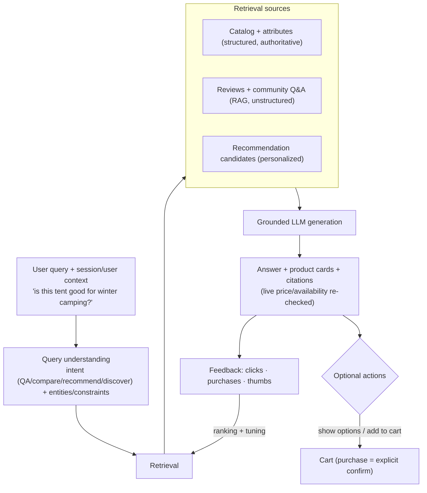
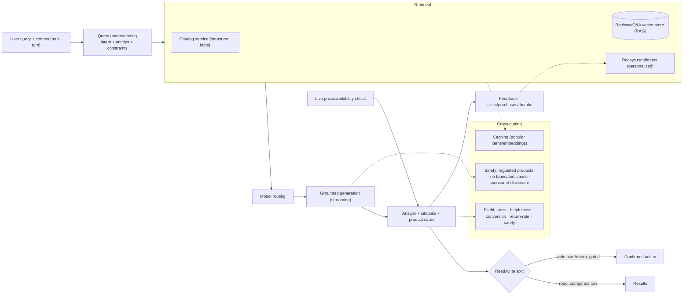

# Mock Problem 10: Design Amazon Rufus (Conversational Shopping Assistant)

> **Archetype:** conversational commerce RAG + agentic assistant · **Difficulty:** senior · **Great for:** grounded product QA, RAG over catalog + reviews, personalization, safety in commerce.

## The Prompt
*"Design Amazon Rufus — an AI shopping assistant embedded in the Amazon app that answers product questions, compares items, gives recommendations, and helps customers decide what to buy, grounded in Amazon's catalog, reviews, and Q&A."*

## 40-Minute Game Plan
| Phase | Focus | Min |
|---|---|---|
| C | Scope (advise vs. transact), grounding, scale | 6 |
| H | Query understanding → retrieval → grounded generation | 8 |
| A | RAG over catalog/reviews, recommendation blend, personalization, safety | 13 |
| S | Latency, serving, cost at retail scale | 6 |
| E | Agentic actions, eval, hallucination control | 5 |
| — | Recap | 2 |

---

## C — Clarify & Scope
- **What can it do?** Answer product questions, compare, recommend, guide discovery. Does it **transact** (add to cart / buy)? Assume advise + light actions (add to cart), purchase gated. Distinguishing advice from transactions matters.
- **Grounding sources:** product catalog + attributes, **customer reviews**, community Q&A, product docs — answers must be **grounded and truthful** (wrong product claims → returns, liability, trust loss).
- **Personalization:** order history, browsing, prior purchases.
- **Scale:** hundreds of millions of products, huge traffic, interactive latency.

**Non-functional:** low-latency streaming answers, **faithful/grounded** (no hallucinated specs/claims), personalized, safe (no unsafe product advice), cost-controlled at retail scale.

**Tips & suggestions**
- Draw the line between **advise** (free) and **transact** (gated) early — read/write split shows commerce-safety awareness.
- Stress that **commerce hallucinations are expensive** (returns, liability), so grounding + citations are non-negotiable.
- Note two source types up front: **authoritative structured facts** (specs/price) vs. **experiential unstructured** (reviews/Q&A).

**Expected interviewer follow-ups**
- *"How is Rufus different from search/recsys?"* — Conversational grounded synthesis across catalog + reviews + Q&A with multi-turn reasoning ("is this good for X?"), not a ranked list; it uses recsys as a candidate source.
- *"Should it buy for the user?"* — Advice and cart-add can be assisted, but purchases require explicit confirmation.
- *"What must never happen?"* — Inventing specs/prices/claims; that causes returns and liability.

## H — High-Level Architecture

**Tips & suggestions**
- Show **structured catalog retrieval and review RAG as parallel branches** feeding one grounded answer — they serve different question types.
- Put **live price/availability re-check** on the product-card path; cached specs are unsafe for purchase decisions.

**Expected interviewer follow-ups**
- *"Structured or vector retrieval?"* — Both: structured for authoritative specs/price, RAG over reviews/Q&A for experiential/subjective questions.
- *"How do you handle multi-turn ('this one', 'the cheaper one')?"* — Session context in query understanding resolves references and carries constraints.
- *"How does recsys fit in?"* — As a personalized candidate source that the assistant reranks and explains conversationally.

## A — AI/ML Deep Dive
**Query understanding:** classify intent (factual product QA, comparison, recommendation, open discovery) and extract entities/constraints (budget, use case, attributes). Multi-turn context (pronouns, "this one").

**Retrieval (hybrid, grounded):**
- **Structured retrieval** over the catalog for specs/attributes/price/availability (authoritative facts).
- **RAG over reviews + Q&A** (embeddings + keyword) for subjective/experiential answers ("good in winter?") — retrieve relevant snippets and **cite** them.
- **Recommendation candidates** from the existing recsys (personalized), reranked for the query.

**Grounded generation:**
- LLM synthesizes an answer **strictly from retrieved facts + reviews**, citing sources, and **must not invent specs, prices, or claims** — commerce hallucinations are costly. Prefer "based on reviews…" with attribution.
- Return **product cards** (structured, live price/availability re-checked) alongside prose.

**Personalization:** condition on history/preferences (owns compatible gear, budget tier) for recommendations, respecting privacy.

**Safety:** guardrails for unsafe/regulated products (medical, weapons), no fabricated health/safety claims, avoid manipulative upselling; brand-safe tone.

**Tips & suggestions**
- Separate **authoritative facts** (never paraphrase price/specs — pull live) from **experiential synthesis** (attribute to reviews).
- Bring up **regulated-product safety** (medical/weapons) and no fabricated health claims — a commerce-specific probe.
- Mention **sponsored-item disclosure** to preempt the fairness/manipulation question.

**Expected interviewer follow-ups**
- *"How do you prevent hallucinated product claims?"* — Ground strictly in structured catalog facts + cited reviews, re-check live price/availability, refuse/hedge when unsupported.
- *"How do you personalize without being creepy or unfair?"* — Use history for relevance, disclose sponsored items, avoid manipulative upsell, respect privacy.
- *"How do you answer subjective questions ('good for winter')?"* — RAG over reviews/Q&A with attribution ("based on reviews…"), not model opinion.

## S — System & Infra Deep Dive
- **Latency:** stream tokens; parallelize retrieval; cache popular product context/embeddings.
- **Freshness:** price/availability are volatile → fetch **live** for product cards, don't trust cached specs for purchase decisions.
- **Cost:** model routing (small for intent/simple QA, large for synthesis/compare), retrieval budgeting, caching at massive query volume.
- Serving: query-understanding + vector store (reviews) + catalog service + recsys + LLM endpoints.

**Tips & suggestions**
- Parallelize the retrieval branches and **stream tokens** to hide latency.
- **Model routing** (small for intent/simple QA, large for synthesis) is the primary cost lever at retail query volume.

**Expected interviewer follow-ups**
- *"How do you keep latency low?"* — Token streaming, parallel retrieval, caching popular product context/embeddings.
- *"How do you handle volatile price/availability?"* — Live fetch for product cards; never rely on cached values for purchase decisions.
- *"How do you control cost at Amazon scale?"* — Model routing, tight retrieval budgets, and aggressive caching of popular items.

## E — Extensions & Trade-offs
- **Agentic actions:** move from advice → actions (add to cart, track order, initiate return) with the **read/write split** and **confirmation gates** on anything transactional (never auto-purchase).
- **Faithfulness vs. helpfulness:** strict grounding may limit answers; always prefer cited/grounded over confident-but-wrong.
- **Evaluation:** answer faithfulness/citation accuracy, helpfulness (human/LLM-judge), purchase/engagement lift and return-rate impact online, latency, and safety violation rate. A/B on conversion + satisfaction.
- **Bias/fairness:** avoid unfairly favoring certain sellers/sponsored items without disclosure.

**Tips & suggestions**
- Present **agentic actions with a read/write split** as the natural evolution — reads free, writes gated.
- Propose **return-rate** as a distinctive online metric — a wrong recommendation shows up as returns, not just low CSAT.

**Expected interviewer follow-ups**
- *"How do you evaluate?"* — Faithfulness/citation accuracy and helpfulness offline; conversion/engagement lift, return-rate, satisfaction, and safety-violation rate online.
- *"What agentic actions would you add and how safely?"* — Cart-add/track/return via tools with confirmation gates; purchases always explicit.
- *"How do you keep it fair across sellers?"* — Disclose sponsored placements; avoid undisclosed bias toward specific sellers.

## Final Architecture

## 60-Second Close
"Rufus understands the shopping intent, retrieves authoritative specs/price from the structured catalog plus experiential context via RAG over reviews and Q&A, and blends in personalized recommendation candidates. An LLM synthesizes a grounded, cited answer with live product cards, never inventing claims, and can take gated actions (cart-add; purchases require confirmation). It's served with streaming, model routing, and caching at retail scale, and evaluated on faithfulness, helpfulness, conversion/return impact, and safety."
