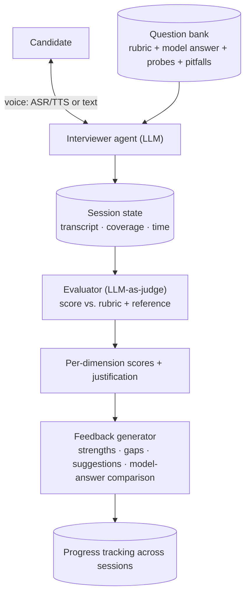
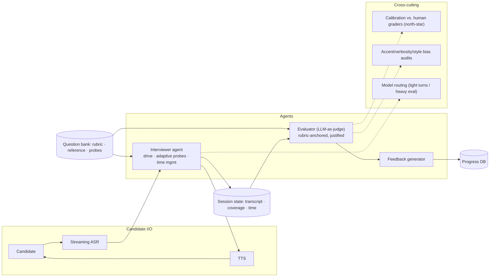

# Mock Problem 11: Virtual Mock-Interview Agent for AI System Design

> **Archetype:** conversational evaluation/tutoring agent · **Difficulty:** mid–senior · **Great for:** dialogue management, rubric-based evaluation, feedback generation, LLM-as-judge. (Delightfully meta.)

## The Prompt
*"Design a virtual mock-interview agent that conducts AI system design interviews — asks a question, probes with follow-ups like a real interviewer, evaluates the candidate's answer against a rubric, and gives structured feedback so candidates can practice and improve."*

## 40-Minute Game Plan
| Phase | Focus | Min |
|---|---|---|
| C | Interview flow, evaluation rubric, modality | 6 |
| H | Question bank → interviewer agent → evaluator → feedback | 8 |
| A | Dialogue/probing, rubric-based scoring, feedback gen, fairness | 13 |
| S | Session state, voice, serving | 6 |
| E | Personalization, anti-gaming, eval | 5 |
| — | Recap | 2 |

---

## C — Clarify & Scope
- **Interview flow:** the agent must **drive** a realistic session — pose a problem, ask **adaptive follow-ups** (probe weak spots), manage a ~40-min clock, and stay in role. Not a Q&A bot; an interviewer simulation.
- **Evaluation:** score against a **rubric** (e.g., CHASE phases: scoping, high-level design, ML depth, infra, trade-offs; plus communication) and give **actionable feedback**.
- **Modality:** text and/or **voice** (real interviews are spoken → ASR + TTS). Clarify.
- **Content grounding:** questions and "good answer" references from a curated bank so evaluation is grounded, not vibes.

**Non-functional:** natural low-latency dialogue (especially voice), **consistent/fair** scoring, grounded feedback, session persistence.

**Tips & suggestions**
- Stress it's an **interviewer simulation** (drives, probes, manages time), not a Q&A bot — that reframing is the whole design.
- Separate **two agents up front**: interviewer (drive dialogue) vs. evaluator (score) — they have different objectives.
- Ask about **modality (voice)** early; ASR/TTS changes latency and fairness considerations.

**Expected interviewer follow-ups**
- *"How does it behave like a real interviewer, not a chatbot?"* — Adaptive follow-ups tied to uncovered rubric areas, time/phase management, staying in role, probing depth rather than revealing answers.
- *"Text or voice?"* — Support both; voice needs streaming ASR/TTS and accent robustness.
- *"What grounds the evaluation?"* — A curated bank: each question has a rubric, reference answer, and probe list.

## H — High-Level Architecture

**Tips & suggestions**
- Show **session state feeding the evaluator** — scoring at the end with full context is fairer than turn-by-turn.
- Keep the **question bank** as an explicit grounding source for both interviewing and scoring.

**Expected interviewer follow-ups**
- *"Why grade at the end vs. live?"* — Full-context scoring is more coherent and fair; a separate practice mode can give live hints.
- *"How does the agent track coverage and time?"* — Session state records which rubric areas are covered and elapsed time, driving probes and nudges.

## A — AI/ML Deep Dive
**Question bank & grounding:** curated problems each with a **rubric**, a reference/model answer, and a list of **probing follow-ups** and common pitfalls. Grounds both interviewing and scoring (avoids the LLM making up standards).

**Interviewer agent (dialogue management):**
- LLM in an interviewer persona: opens with the problem, listens, and asks **adaptive follow-ups** targeting rubric areas the candidate hasn't covered ("you skipped scoping — what would you clarify?").
- **Time management:** tracks the 40-min budget and phase coverage; nudges/moves on like a real interviewer.
- Stays in role — doesn't just hand over the answer.

**Evaluation (rubric-based, LLM-as-judge):**
- Score the transcript per rubric dimension (scoping, HLD, ML depth, infra, trade-offs, communication) with **evidence/justification**, comparing to the reference answer.
- Mitigate LLM-judge issues: use the rubric + reference to anchor, structured/CoT scoring, calibrate against human-graded transcripts, avoid length/verbosity bias.

**Feedback generation:** structured, actionable output — strengths, specific gaps, what a strong answer adds, and next-step suggestions/resources. This is the product's value.

**Fairness/consistency:** same rubric applied uniformly; guard against penalizing accent (ASR errors), verbosity, or style over substance.

**Tips & suggestions**
- Anchor scoring on **rubric + reference answer** with justifications — this fixes both hallucinated standards and consistency.
- Name the **LLM-judge biases** (verbosity, position, style) and the mitigations (structured scoring, calibration).
- Make feedback **actionable and specific** (what a strong answer adds) — that's the product's actual value.

**Expected interviewer follow-ups**
- *"How do you keep scoring fair and consistent?"* — Anchor on an explicit rubric + reference, structured justified scoring, calibrate against human-graded transcripts, and audit for verbosity/accent/style bias.
- *"How do you stop candidates gaming it?"* — Vary questions/probes and score reasoning/trade-offs, not keyword bingo.
- *"How does it probe adaptively?"* — Compare covered vs. rubric-required areas and ask targeted follow-ups on the gaps.

## S — System & Infra Deep Dive
- **Session state:** durable per-session context (transcript, coverage, time) so long interviews stay coherent and resumable.
- **Voice:** streaming ASR (low latency, robust to accents) + TTS; barge-in handling; keep turn latency low for natural conversation.
- **Serving:** LLM endpoints (interviewer + evaluator can be separate calls/models), transcript store, progress DB.
- **Cost:** interviewer uses a capable model; routine turns can use smaller models; evaluation batched at end.

**Tips & suggestions**
- Call out **barge-in and low turn latency** for voice — awkward pauses break the interview illusion.
- Batch the **heavy evaluation at the end**; keep per-turn interviewer calls light for cost and latency.

**Expected interviewer follow-ups**
- *"How do you handle voice?"* — Streaming ASR + TTS with low turn latency and barge-in; be robust to accents so ASR errors don't hurt scores.
- *"How do you keep long sessions coherent?"* — Durable session state (transcript, coverage, time) that also enables resume.

## E — Extensions & Trade-offs
- **Personalization/adaptivity:** target the candidate's role/level (junior vs. staff expectations) and adapt difficulty to their track record.
- **Anti-gaming:** candidates may memorize; vary questions/probes, evaluate reasoning not keywords.
- **Real-time vs. end scoring:** score at the end for coherence; optional live hints for a "practice" mode vs. strict "exam" mode.
- **Evaluation of the evaluator:** correlate agent scores with expert human graders (inter-rater agreement); this is the key quality metric — an unfair judge is worse than none.
- Safety/bias audits across demographics/accents.

**Tips & suggestions**
- Make **"does the evaluator agree with human graders?"** your north-star metric — an unfair judge is worse than none.
- Offer **role/level adaptivity** (junior vs. staff bar) as the personalization story.

**Expected interviewer follow-ups**
- *"How do you validate the evaluator?"* — Measure agreement between agent scores and expert human graders; treat that correlation as the north-star metric.
- *"Real-time or post-hoc feedback?"* — Post-hoc for fair full-context scoring; a separate practice mode can give live hints.
- *"How do you adapt to seniority?"* — Apply level-specific rubric expectations and difficulty.

## Final Architecture

## 60-Second Close
"An interviewer agent, grounded in a rubric+reference question bank, drives an adaptive, time-managed dialogue (text or voice via ASR/TTS), probing uncovered areas like a real interviewer. A separate LLM-as-judge scores the transcript per rubric dimension with justifications anchored to the reference answer, and a feedback generator returns structured strengths/gaps/next-steps. Sessions are durable, scoring is calibrated against human graders (the key metric), and the system audits for accent/verbosity bias."
