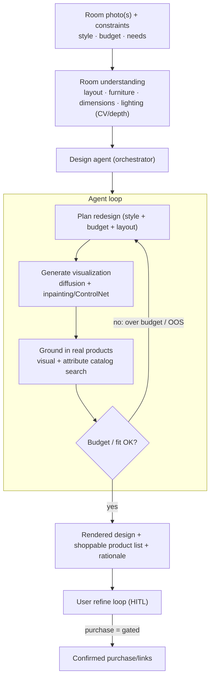
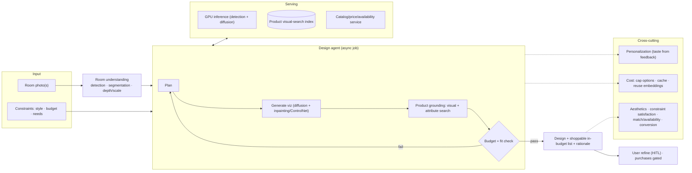

# Mock Problem 12: Interior-Designer Agentic System

> **Archetype:** multimodal generative + agentic (design + shop) · **Difficulty:** senior · **Great for:** image generation/editing, multimodal understanding, agentic product grounding, HITL.

## The Prompt
*"Design an interior-designer agentic system: users upload photos of their room (and constraints like style, budget), and the system generates personalized redesign visualizations and can source real, shoppable products to realize the design."*

## 40-Minute Game Plan
| Phase | Focus | Min |
|---|---|---|
| C | Inputs, output (image vs shoppable plan), constraints | 6 |
| H | Room understanding → design gen → product grounding → plan | 8 |
| A | Image gen/edit, spatial understanding, product matching, agent loop | 13 |
| S | Async generation, serving, cost | 6 |
| E | Realism/constraints, HITL, eval | 5 |
| — | Recap | 2 |

---

## C — Clarify & Scope
- **Inputs:** room **photo(s)** (+ maybe dimensions), style preference (mid-century, minimalist), **budget**, functional needs (WFH desk, kid-safe).
- **Output — clarify the ambition:** (a) inspirational **redesign images** only, or (b) a **shoppable plan** — visualization + a list of real, in-budget, purchasable products that match. The agentic, valuable version is (b).
- **Constraints matter:** budget, room dimensions/layout, keep-vs-replace items — the design must be *feasible*, not just pretty.
- **Transaction?** Recommend/link products vs. actually purchasing — gate purchases.

**Non-functional:** visually compelling + **realistic/feasible** designs, grounded in **real available products**, personalized, reasonable latency (async generation OK), cost-aware.

**Tips & suggestions**
- Pin the **output ambition** immediately: pretty pictures vs. a **shoppable, in-budget plan**. The agentic version (b) is what earns the "agentic" label.
- Stress **feasibility constraints** (budget, dimensions, keep-vs-replace) — a design you can't buy or fit is worthless.
- Gate **purchases** (read/write split) as a scoping note.

**Expected interviewer follow-ups**
- *"Images only or shoppable?"* — Shoppable plan: visualization grounded in real, in-budget, available products — that's the valuable, agentic version.
- *"What constraints must hold?"* — Budget total, item dimensions fitting the room, and keep-vs-replace choices.
- *"Does it buy for the user?"* — Recommend/link freely; gate actual purchases behind confirmation.

## H — High-Level Architecture

**Tips & suggestions**
- Show the **replanning loop** explicitly (budget/fit fails → re-plan) — that iterative tool use is what makes it an agent, not a one-shot generator.
- Put **room understanding before generation** so the redesign is conditioned on the real space.

**Expected interviewer follow-ups**
- *"What makes this 'agentic'?"* — It uses tools (catalog search, budget calculator), checks constraints, and replans on failure — a loop, not a single generation.
- *"Why understand the room first?"* — To spatially condition generation and to size/fit products to the actual space.

## A — AI/ML Deep Dive
**Room understanding (multimodal input):**
- Detect room type, layout, existing furniture, and constraints from the photo (object detection + segmentation, **depth/scale** estimation). This grounds generation in the *actual* space.

**Design generation:**
- **Image generation/editing** conditioned on the room: diffusion models with **inpainting / ControlNet-style spatial conditioning** so the redesign preserves room geometry (walls, windows) rather than hallucinating a new room. Style/text conditioning for the aesthetic.
- Generate a few options across styles/price points.

**Product grounding (the agentic value):**
- The pretty picture is useless if you can't buy it. Match generated/desired items to **real catalog products** via **visual search (image embeddings + ANN)** + attribute filters (style, color, **price within budget**, availability, dimensions that fit).
- This is where it becomes an *agent*: it uses tools (catalog search, budget calculator) and **replans** when items are over budget or out of stock.

**Agent loop / planning:** orchestrate understand → generate → source → budget-check → replan; keep the total within budget and items dimensionally feasible; ask the user when constraints conflict (HITL).

**Personalization:** learn taste from feedback/past choices; condition generations and product ranking.

**Tips & suggestions**
- Emphasize **spatial conditioning (inpainting/ControlNet + depth)** so the redesign stays in the user's real room — a common failure is hallucinating a new room.
- Frame **product grounding via visual + attribute search** as the bridge from art to commerce.
- Note the agent **replans** on budget/availability failures — concrete tool-use behavior.

**Expected interviewer follow-ups**
- *"How do you keep the redesign in the actual room?"* — Spatially-conditioned generation (inpainting/ControlNet + depth) preserves geometry; understand layout first, then edit within it.
- *"How do you make it shoppable?"* — Visual search (image embeddings + ANN) + attribute/budget/availability filters to match generated items to real catalog products.
- *"How do constraints get respected?"* — The agent budget- and fit-checks sourced items and replans (swap/adjust) when over budget or unavailable; asks the user on conflicts.

## S — System & Infra Deep Dive
- **Async generation:** image diffusion + multi-item sourcing is heavy → run as an async job with progress; stream previews.
- **Serving:** GPU inference for detection + diffusion; visual-search index over the product catalog; catalog/price service for live availability.
- **Cost:** image generation is expensive — cache, limit option count, route (cheap retrieval vs. expensive generation), reuse embeddings.

**Tips & suggestions**
- Treat generation as an **async job with progress/previews** — synchronous diffusion + sourcing is too slow.
- Name the cost levers: **cap option count, cache, reuse embeddings, cheap retrieval vs. expensive generation**.

**Expected interviewer follow-ups**
- *"Latency?"* — Async generation with progress/previews; diffusion + multi-item sourcing is too heavy for synchronous.
- *"What's expensive and how do you control it?"* — Image generation; cap options, cache renders/embeddings, route retrieval vs. generation.

## E — Extensions & Trade-offs
- **Creativity vs. feasibility:** free-form generation looks best but may not be buildable/shoppable; **spatial + budget + availability constraints** pull toward realism. Balance, and ground the final plan in real products.
- **HITL:** user approves/refines the design; **purchases gated** (read/write split — never auto-buy).
- **AR preview** (place products in the actual room via AR) as an extension.
- **Evaluation:** design quality/aesthetics (human ratings, engagement), **constraint satisfaction** (budget/fit), product-match relevance and availability accuracy, conversion, and user satisfaction/refinement count.
- Safety: avoid unsafe layouts; disclose sponsored products.

**Tips & suggestions**
- Balance **creativity vs. feasibility** explicitly — the best-looking design isn't useful if it's unbuyable.
- Combine subjective (**aesthetic ratings**) with objective (**constraint satisfaction, product-match/availability**) evaluation.

**Expected interviewer follow-ups**
- *"How do you evaluate something subjective like design?"* — Human aesthetic ratings + engagement, plus objective constraint-satisfaction (budget/fit) and product-match/availability accuracy and conversion.
- *"Purchase for the user?"* — Recommend and link freely; gate actual purchases behind explicit confirmation.
- *"What extension adds most value?"* — AR preview to place sourced products in the real room.

## Final Architecture

## 60-Second Close
"Understand the real room (detection + segmentation + depth), then a design agent generates spatially-conditioned redesign visualizations (diffusion + inpainting/ControlNet) and — crucially — grounds them in real, in-budget, available catalog products via visual + attribute search, replanning when items break the budget or fit. The user refines (HITL); purchases are gated. It runs async with GPU inference and a visual-search index, and is judged by aesthetic ratings, constraint satisfaction, product-match accuracy, and conversion."
