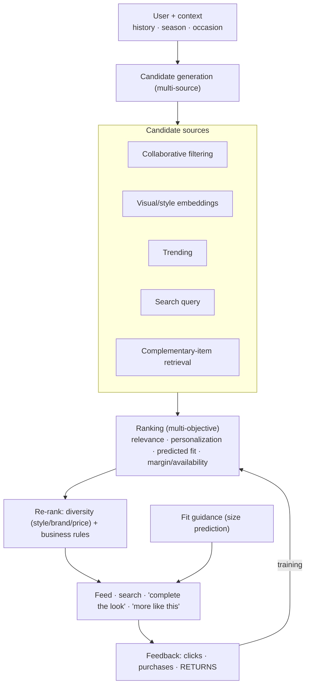
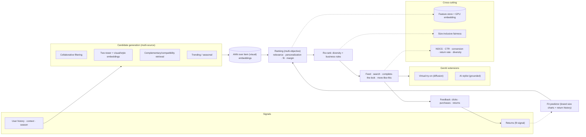

# Mock Problem 13: Design Amazon Fashion

> **Archetype:** recommendations + visual understanding + GenAI · **Difficulty:** senior · **Great for:** multi-stage recsys, visual/style embeddings, cold start, fashion-specific signals. See also book Chs. 9, 14.

## The Prompt
*"Design Amazon Fashion — the discovery and recommendation experience for apparel/accessories: personalized recommendations, search, 'complete the look' / outfit pairing, size/fit guidance, and visual browsing."*

## 40-Minute Game Plan
| Phase | Focus | Min |
|---|---|---|
| C | Which surface(s), fashion-specific challenges | 6 |
| H | Multi-stage recsys + visual + search | 8 |
| A | Retrieval/ranking, style embeddings, fit, complementary items, cold start | 13 |
| S | Serving, latency, freshness | 6 |
| E | GenAI (try-on/stylist), eval, fairness | 5 |
| — | Recap | 2 |

---

## C — Clarify & Scope
- **Which surface?** Personalized feed/recommendations, search, **"complete the look"** (complementary outfit), **size/fit** guidance, visual similarity ("more like this"). Pick recommendations + visual + fit as the core; mention the rest.
- **Fashion-specific challenges (call these out — they differentiate from generic recsys):**
  - **Visual/style** dominates decisions (not just text attributes).
  - **Size & fit** — a huge driver of purchases and **returns** (fit is the #1 return reason).
  - **Trend/seasonality** and fast catalog churn; heavy **cold start** (new items constantly).
  - **Complementarity** (pairing) vs. **substitutability** (similar items).
- Scale: hundreds of millions of items, massive traffic, interactive latency.

**Non-functional:** low-latency personalized ranking, visual understanding, fit accuracy (reduce returns), freshness for trends/new items, fairness across brands/sizes.

**Tips & suggestions**
- List the **fashion-specific challenges** explicitly (visual, fit/returns, trend churn, complementarity) — this is how you signal you won't just apply generic CF.
- Call **returns/fit** the standout business metric up front — it separates fashion from other recsys.
- Scope to recommendations + visual + fit as the core; mention search/"complete the look" as adjacent.

**Expected interviewer follow-ups**
- *"How is fashion recsys different from generic recsys?"* — Visual/style dominates, fit drives returns, heavy cold start + trend churn, and complementarity (outfits) matters beyond similarity.
- *"Which surface will you design?"* — Recommendations + visual similarity + fit as core; "complete the look" and search as extensions.
- *"What's the key business metric?"* — Conversion and, distinctively, return rate (fit failures).

## H — High-Level Architecture

**Tips & suggestions**
- Anchor on the **multi-stage funnel** (candidate gen → rank → re-rank), then layer fashion twists onto it — familiar spine, specialized signals.
- Show **returns as an explicit feedback signal** feeding training — most candidates only draw clicks/purchases.

**Expected interviewer follow-ups**
- *"Similarity vs. complementarity?"* — Similar = substitutes ("more like this," visual embeddings); complementary = go-together outfits (compatibility models). Different objectives and retrieval.
- *"Where does visual understanding enter?"* — Candidate generation (style embeddings), "more like this," outfit compatibility, and cold start.
- *"What signals does generic recsys miss?"* — Returns (fit), seasonality/trends, and visual style.

## A — AI/ML Deep Dive
**Multi-stage recsys (Ch. 9):** candidate generation (fast, high-recall) → ranking (precise) → re-rank (diversity/business). Standard funnel, fashion-tuned.

**Visual & style understanding (the fashion twist):**
- **Image embeddings** (CNN/ViT/CLIP) capture style/aesthetics beyond text attributes → power "more like this," style-based candidate generation, and outfit compatibility.
- **Two-tower** user/item retrieval augmented with visual features.

**Complementary items ("complete the look"):**
- Learn **compatibility** (which items go together) from co-purchase/co-view and visual compatibility models — distinct from *similarity*. Retrieve complements (top → bottom → shoes) that form coherent outfits.

**Size & fit:**
- Predict fit per user-item from purchase/return history, size charts, brand-specific sizing (a "M" varies by brand), body/fit feedback. Predicted fit feeds ranking (rank items likely to fit) and reduces **returns** — a key business metric.

**Cold start (severe in fashion):**
- New items: use **content/visual embeddings** (works day one, no interactions). New users: onboarding style quiz, popularity/trend priors, context.

**Trend/seasonality:** freshness signals, recency-weighted popularity, seasonal features.

**Tips & suggestions**
- Use **visual embeddings for cold start** — new items work day one with no interaction history, which is huge given constant catalog churn.
- Model **fit prediction with brand-specific sizing** (a "M" differs by brand) and feed it into ranking to cut returns.
- Distinguish **compatibility models (outfits)** from **similarity models (substitutes)** — different training data and objective.

**Expected interviewer follow-ups**
- *"How do you handle size/fit?"* — Predict fit from purchase/return history + brand-specific size charts + fit feedback; rank for likely fit to cut returns.
- *"Cold start?"* — Content/visual embeddings for new items; style quiz + trends for new users.
- *"Two-tower plus visual — how?"* — Augment the item tower with visual/style embeddings so retrieval is style-aware, not just ID/text-based.

## S — System & Infra Deep Dive
- **Serving:** ANN retrieval over item (incl. visual) embeddings, feature store, ranking model service; low latency.
- **Freshness:** fast item ingestion + embedding for new products; frequent candidate/index updates for trends.
- **Feedback:** clicks/purchases **and returns** (returns are a critical negative signal for fit).
- Precompute embeddings; cache; GPU for image embedding at catalog scale.

**Tips & suggestions**
- Precompute **item (incl. visual) embeddings on GPU** and serve via ANN — keeps ranking latency low at catalog scale.
- Prioritize **fast ingestion + embedding of new items** so trends/new arrivals surface quickly.

**Expected interviewer follow-ups**
- *"How do you serve at low latency?"* — ANN over precomputed embeddings + feature store + a ranking service; cache hot candidates.
- *"How do you keep up with trends/new items?"* — Fast item embedding on ingest and frequent index/candidate refresh.

## E — Extensions & Trade-offs
- **GenAI extensions:** **virtual try-on** (diffusion-based garment transfer onto the user), an **AI stylist** (conversational outfit advice grounded in catalog — Rufus-like), and generated outfit inspiration.
- **Trade-offs:** relevance vs. diversity (don't show 20 near-identical black dresses), personalization vs. discovery/trends, margin vs. user value, and fit-accuracy vs. showing aspirational items.
- **Fairness:** representation across sizes (inclusive sizing), brands, and body types; avoid biasing only toward popular brands.
- **Evaluation:** offline ranking (NDCG, recall@k), online **CTR, conversion, and return rate** (fit), diversity, and revenue; A/B. Return-rate reduction is a standout fashion metric.

**Tips & suggestions**
- Weave in **GenAI (virtual try-on, AI stylist)** grounded in the real catalog — modern and directly relevant to fashion.
- Raise **size-inclusive fairness** (across sizes/brands/body types) — an ethical and business-relevant probe.

**Expected interviewer follow-ups**
- *"Where does GenAI fit?"* — Virtual try-on, conversational stylist, generated inspiration — grounded in the real, available catalog.
- *"How do you evaluate?"* — NDCG/recall@k offline; CTR, conversion, return rate, diversity, revenue online via A/B; return-rate reduction is the fashion standout.
- *"Fairness?"* — Representation across sizes/brands/body types; avoid biasing only toward popular brands.

## Final Architecture

## 60-Second Close
"A multi-stage recsys (candidate generation → ranking → diversity re-rank) tuned for fashion: visual/style embeddings (CLIP/ViT) drive 'more like this' and cold start, compatibility models power 'complete the look,' and a fit predictor (from purchase/return history + brand size charts) ranks for fit to cut returns. It handles trend/seasonality and severe cold start via content embeddings, serves via ANN + feature store at low latency, extends to GenAI try-on and an AI stylist, and is measured by conversion and — distinctively — return rate, alongside NDCG and diversity."
