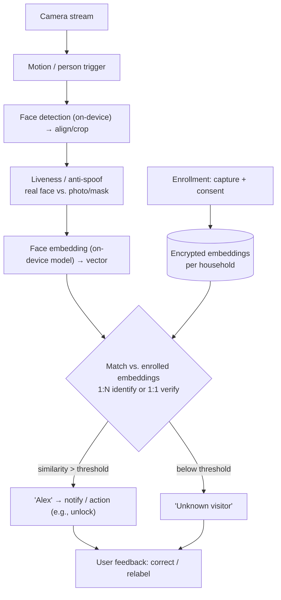
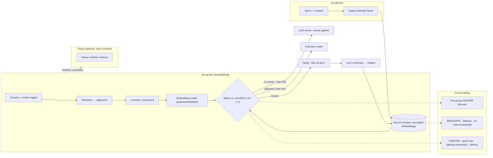

# Mock Problem 14: User Identification & Authentication in Amazon Ring

> **Archetype:** biometric CV (face recognition) + security/privacy · **Difficulty:** senior · **Great for:** verification vs. identification, embeddings + matching, on-device, spoofing, privacy/ethics.

## The Prompt
*"Design the system that identifies and authenticates people at the door for Amazon Ring — e.g., recognizing known/familiar faces ('Alex is at the door'), flagging unknown visitors, and doing so reliably, privately, and securely on a home camera."*

## 40-Minute Game Plan
| Phase | Focus | Min |
|---|---|---|
| C | Identify vs. authenticate, enrollment, on-device, privacy | 6 |
| H | Detect → embed → match → decide (on-device + cloud) | 8 |
| A | Face embeddings, matching, liveness/anti-spoof, thresholds | 12 |
| S | On-device inference, storage, edge/cloud split | 7 |
| E | Privacy/ethics/bias, eval, security | 5 |
| — | Recap | 2 |

---

## C — Clarify & Scope
- **Identification vs. authentication (be precise):**
  - **Identification (1:N):** "who is this?" — match a face against enrolled familiar faces (family, frequent visitors).
  - **Authentication/verification (1:1):** "is this the authorized person?" — e.g., unlocking a smart lock. Higher security bar.
  - Clarify which; Ring's "familiar faces" is mainly **identification/notification**, but auth (door unlock) raises the stakes.
- **Enrollment:** users opt-in and label familiar faces; consent is central.
- **On-device vs. cloud:** privacy + latency push face processing **on-device** where possible; heavy matching may be cloud.
- **Spoofing:** photos/videos/masks at the door → **liveness / anti-spoofing** matters, especially for auth.

**Non-functional:** high accuracy at a controlled **false-accept rate** (security), low latency, on-device/privacy-first, robust to lighting/angle/occlusion, fair across demographics, secure biometric storage.

**Tips & suggestions**
- Distinguish **identification (1:N)** from **authentication (1:1)** in the first minute — it sets the entire security bar and threshold strategy.
- Raise **privacy, consent, and biometric regulation** unprompted; this problem is as much ethics/security as ML.
- Note **on-device processing** as a scoping decision driven by privacy + latency.

**Expected interviewer follow-ups**
- *"Identification vs. authentication — why does it matter?"* — 1:N for notifications tolerates more error; 1:1 verification for unlocking demands a very low FAR + liveness because a false accept means unauthorized entry.
- *"What's the enrollment flow?"* — Opt-in, consent, user labels familiar faces; store embeddings, not raw images.
- *"On-device or cloud?"* — On-device for detection/embedding (privacy + latency); cloud only for heavy models/backup with strict controls.

## H — High-Level Architecture

**Tips & suggestions**
- Put **liveness before matching** in the diagram — for any auth action, spoof detection is mandatory.
- Show **embeddings stored encrypted per household**, never raw images — the privacy-by-design signal.

**Expected interviewer follow-ups**
- *"Where does liveness sit?"* — Before matching; reject presentation attacks (photo/video/mask) prior to embedding-match, mandatory for unlock actions.
- *"What triggers processing?"* — Motion/person detection, so you're not running recognition on every frame.
- *"What's stored and where?"* — Encrypted embeddings per household on-device; not raw imagery, not cross-household.

## A — AI/ML Deep Dive
**Face recognition as embeddings (not classification):**
- **Detect → align → embed** with a face-recognition model (e.g., ArcFace/FaceNet-style) producing an embedding; **compare by distance** to enrolled embeddings. Embeddings (not a fixed classifier) let you add/remove people without retraining — essential for per-household enrollment.
- **1:N identification:** nearest enrolled embedding within threshold. **1:1 verification:** compare to the claimed identity's embedding.

**Thresholds & error trade-off (security-critical):**
- **False Accept Rate (FAR)** vs. **False Reject Rate (FRR)**. For **authentication** (unlocking), FAR must be very low (a false accept = unauthorized entry) → strict threshold. For **notification** (identification), you can be more lenient. Set operating point by use case.

**Liveness / anti-spoofing:** detect presentation attacks (printed photo, phone video, mask) via texture/depth/motion cues, challenge–response, or multi-frame analysis. Mandatory for auth.

**Robustness:** handle varied **lighting** (day/night/IR), angle, distance, occlusion (hats/masks), low-res doorbell cameras; multi-frame aggregation improves reliability.

**Fairness:** face models can have **demographic accuracy gaps** — evaluate and mitigate bias across skin tone/age/gender; this is an ethical + accuracy requirement, not optional.

**Tips & suggestions**
- Use **embeddings + distance matching**, not a fixed-class classifier — households add/remove people without retraining.
- Lead with the **FAR/FRR trade-off** and set the operating point by use case (strict for unlock, lenient for notify).
- Treat **demographic fairness** as a first-class requirement and report per-group FAR/FRR.

**Expected interviewer follow-ups**
- *"Classifier or embeddings?"* — Embeddings + distance matching, so per-home dynamic identities work without retraining.
- *"How do you set the threshold?"* — By use case via FAR/FRR: strict (low FAR) for auth/unlock, looser for familiar-face notifications.
- *"How do you stop photo/video spoofing?"* — Liveness/anti-spoofing (texture/depth/motion, multi-frame, challenge–response), mandatory for authentication.
- *"Poor lighting / bad angle?"* — IR/night handling, multi-frame aggregation, alignment, and abstaining ('unknown') when confidence is low.

## S — System & Infra Deep Dive
- **On-device inference** for detection + embedding (latency + privacy): quantized/distilled models on the doorbell/hub. Avoid streaming raw faces to cloud where possible.
- **Biometric storage:** store **embeddings, not raw images**, **encrypted**, per-household, with deletion on opt-out (biometric data is regulated — BIPA/GDPR). Never share across households.
- **Edge/cloud split:** on-device match against local enrolled set; cloud only for heavy models or backup, with strict privacy controls.
- Feedback loop: user corrections relabel/improve the familiar-face set.

**Tips & suggestions**
- Emphasize **on-device match against the local enrolled set** — most homes have a handful of familiar faces, so 1:N is cheap on-device.
- Store biometrics in a **secure enclave**, encrypted, with deletion on opt-out — name BIPA/GDPR to show regulatory awareness.

**Expected interviewer follow-ups**
- *"Why on-device?"* — Latency and, crucially, privacy — avoid streaming raw faces to the cloud.
- *"How do you store biometrics safely?"* — Encrypted embeddings (not images), per-household, secure enclave, deletion on opt-out, no cross-household sharing.
- *"What goes to the cloud, if anything?"* — Optionally heavy models/backup under strict controls; prefer keeping recognition local.

## E — Extensions & Trade-offs
- **Privacy & ethics (huge here):** face recognition on home cameras is sensitive and regulated. **Opt-in consent**, on-device processing, embedding-only encrypted storage, no cross-user sharing, deletion rights, and jurisdictional compliance (some regions ban/limit it). Raise this unprompted — it's a top interviewer concern.
- **Security:** anti-spoofing, secure enclave for biometrics, protect against replay; auth actions (unlock) need the strictest FAR + liveness.
- **Accuracy vs. privacy vs. latency:** on-device is private but resource-limited (smaller models); balance.
- **Evaluation:** FAR/FRR (ROC), accuracy across lighting/angle, **fairness across demographics**, spoof-detection rate, latency, and user-correction rate.

**Tips & suggestions**
- Treat **privacy/ethics/regulation as a headline extension**, not a footnote — it's the top probe for biometric systems.
- Acknowledge the **accuracy vs. on-device size** tension (smaller models on the device) and how you'd balance it.

**Expected interviewer follow-ups**
- *"Privacy?"* — Opt-in consent, on-device processing, encrypted embeddings not images, per-household isolation, deletion on opt-out, and biometric-law compliance; some regions restrict it.
- *"Fairness?"* — Test and mitigate demographic accuracy gaps; report per-group FAR/FRR.
- *"How do you evaluate?"* — FAR/FRR (ROC), accuracy across lighting/angle, per-group fairness, spoof-detection rate, latency, and user-correction rate.

## Final Architecture

## 60-Second Close
"Detect and align faces on-device, run liveness/anti-spoofing, embed with an ArcFace-style model, and match by distance against per-household enrolled embeddings — 1:N for familiar-face notifications, 1:1 verification with a strict low-FAR threshold for unlock actions. Everything privacy-first: on-device inference, encrypted embeddings (not images), consent-based enrollment, deletion rights, and biometric-law compliance, with explicit fairness testing across demographics and robustness to lighting/angle. Evaluate with FAR/FRR, per-group fairness, spoof-detection rate, and latency."
