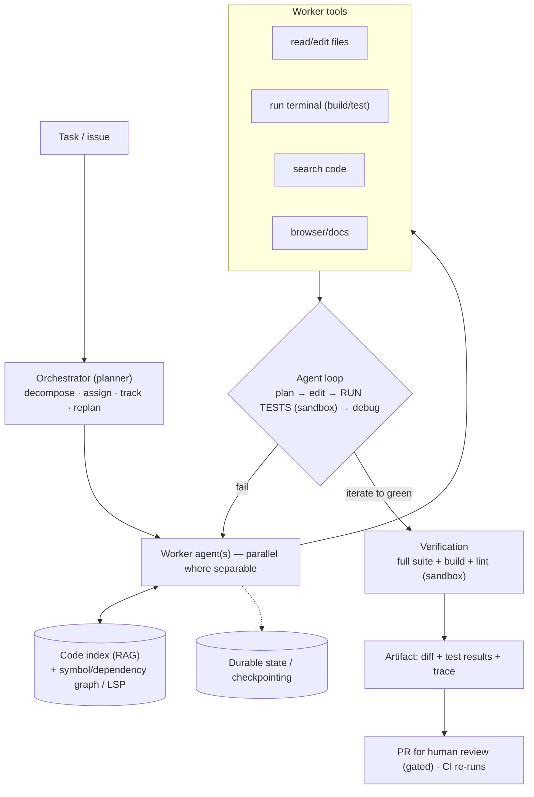
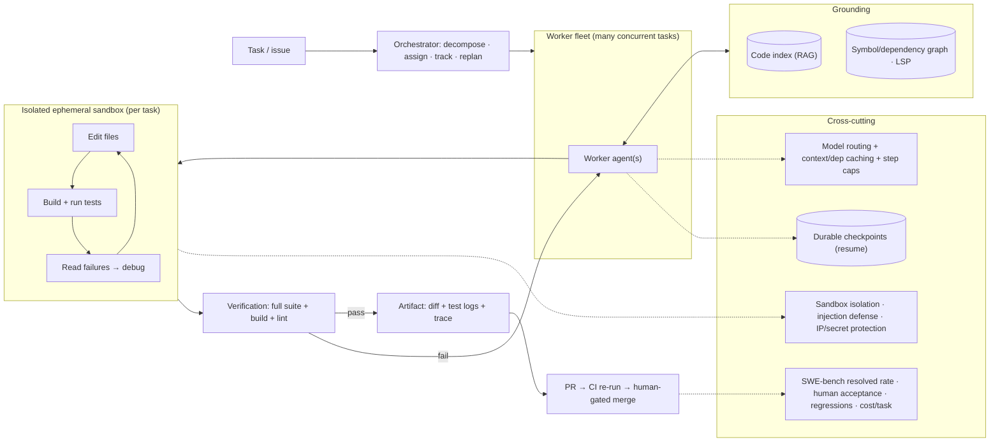

# Mock Problem 15: Autonomous Software-Engineering Agent Platform

> **Archetype:** multi-agent coding at repo scale · **Difficulty:** staff · **Great for:** agent orchestration, sandboxed execution, verification, evaluation (SWE-bench). See also Problems 03, book Chs. 17–18.

## The Prompt
*"Design an applied-ML platform where autonomous software-engineering agents (Devin / SWE-bench level) collaborate to write, execute, test, and debug complex multi-file code changes across real repositories — from an issue/task to a verified, tested pull request."*

## 40-Minute Game Plan
| Phase | Focus | Min |
|---|---|---|
| C | Task scope, autonomy, success definition | 6 |
| H | Orchestrator + worker agents + sandboxed execution | 8 |
| A | Planning, code grounding, edit-test-debug loop, verification | 12 |
| S | Sandbox infra, state, cost/latency, scale | 7 |
| E | Multi-agent trade-offs, safety, eval (SWE-bench) | 5 |
| — | Recap | 2 |

---

## C — Clarify & Scope
- **Task type:** from a natural-language issue/ticket to a **working, tested multi-file change** (PR). Bug fixes, features, refactors. This is autonomous, not autocomplete.
- **Autonomy & humans:** how far unattended? Assume it produces a PR with tests + evidence for **human review** (never auto-merge to prod).
- **Success definition (pin this down):** the change must **compile, pass existing + new tests**, and resolve the task — verifiable success, not "looks plausible." This is the SWE-bench framing.
- **Scale:** many concurrent tasks across many repos/languages; large codebases.

**Non-functional:** correct/verified output, safe sandboxed execution, resumable long-running tasks (minutes–hours), cost-per-task control, human-auditable.

**Tips & suggestions**
- Pin the **success definition** early: verifiable (build + tests pass + task resolved), not plausibility — this is the SWE-bench framing and it drives the whole design.
- State the autonomy boundary: **produces a PR for human review, never auto-merges to prod**.
- Flag **safe sandboxed execution** and **resumable long tasks** as non-functionals now.

**Expected interviewer follow-ups**
- *"What does 'success' mean?"* — Verifiable: compiles, passes existing + new tests, resolves the task — a plausible diff that fails tests is a failure.
- *"How autonomous?"* — Autonomous end-to-end to a PR with evidence; human gates the merge.
- *"Scale?"* — Many concurrent tasks across repos/languages; each in its own sandbox.

## H — High-Level Architecture

**Tips & suggestions**
- Make the **run-tests-in-sandbox verification step** the visual centerpiece — it's what separates an SWE agent from a code generator.
- Show **grounding (code index + symbol graph)** feeding workers; multi-file edits need call-site awareness.
- Draw the **human-gated PR** and independent **CI re-run** — no auto-merge, no force-push.

**Expected interviewer follow-ups**
- *"What makes autonomous SWE work vs. just generating code?"* — The execute–test–debug loop in a sandbox: run tests, read failures, self-correct until verifiable success.
- *"How do you handle multi-file changes across a big repo?"* — Ground with a code index + symbol/dependency graph/LSP to find and edit the right files/callers in context; plan then edit.
- *"Do agents auto-merge?"* — No — output is a PR with test evidence; CI re-runs and a human gates the merge.

## A — AI/ML Deep Dive
**Planning (orchestrator):** decompose the task into steps (locate relevant code → design change → implement → test → debug), maintain state, and **replan** on failures.

**Code grounding (Ch. 17):** RAG over the repo + **symbol/dependency graph / LSP** to locate the right files, understand call sites, and edit in context — essential for multi-file changes; the diff alone isn't enough.

**The edit–execute–test–debug loop (the core of autonomous SWE):**
- The agent edits files, **runs the build and tests in a sandbox**, reads failures/stack traces, and iterates until green. **Execution-grounded self-correction** is what makes it work — the agent learns from real test output, not guesses.
- Writes **new tests** for the change and confirms they pass.

**Verification before "done":** don't declare success on plausibility — require the full suite + build to pass (verifiable). Evidence (test logs) is the artifact.

**Multi-agent collaboration (use judiciously):**
- Parallel workers for **separable** subtasks (e.g., different modules), or role-split (implementer / tester / reviewer / debugger). But fan-out multiplies cost + coordination complexity and risks conflicting edits — **use only when subtasks are truly independent**; a single strong grounded agent often wins (Ch. 7 simplicity principle).
- Shared repo state needs coordination (locks/merges) to avoid stepping on each other.

**Tips & suggestions**
- Center the answer on **execution-grounded self-correction** — real test output, not plausibility, is the feedback signal.
- Treat **multi-agent as a justified choice** (separable subtasks / role-split), not a default; call out merge conflicts and cost.
- Note the agent should **write and pass new tests**, not just make existing ones green.

**Expected interviewer follow-ups**
- *"When do you use multiple agents?"* — Only for separable subtasks or role-splits; fan-out multiplies cost and causes merge conflicts. A single grounded agent is often better.
- *"How does the agent debug?"* — Reads build/test failures and stack traces, forms a hypothesis, edits, and re-runs — grounded in real execution.
- *"How does it know it's done?"* — Full suite + build pass (including new tests); evidence logged as the artifact.

## S — System & Infra Deep Dive
- **Sandboxed execution (mandatory):** each task runs in an **isolated, ephemeral, resource-limited, egress-controlled** container (agents run arbitrary generated code). Snapshot the repo per task; destroy after.
- **Durable state / checkpointing:** tasks run minutes–hours → persist agent state so they resume after interruption and long tasks survive restarts.
- **VCS/CI integration:** output is a branch/PR; CI re-runs tests independently; human review gates merge — never auto-merge, never force-push.
- **Cost/latency:** long loops + big-repo context + repeated test runs are expensive → **model routing** (small for edits/navigation, large for planning/debugging), context budgeting, caching the code index and dependency installs, and **step/iteration caps** to prevent runaway loops.
- **Scale:** orchestrate many concurrent task-sandboxes (a scheduler/worker fleet).

**Tips & suggestions**
- Give the sandbox checklist: **isolated, ephemeral, resource-capped, egress-controlled**, per-task repo snapshot, destroyed after.
- Name the cost levers precisely: **model routing, context budgeting, cache code index + dependency installs, step/time caps**.

**Expected interviewer follow-ups**
- *"Agents run arbitrary code — how is that safe?"* — Isolated, ephemeral, egress-controlled, resource-capped sandboxes per task; no prod/secrets; destroy after.
- *"How do you control cost and runaway loops?"* — Model routing, context/dependency caching, and hard step/time caps with human escalation on repeated failure.
- *"How do you resume a multi-hour task?"* — Durable checkpointed state so it survives interruptions/restarts.

## E — Extensions & Trade-offs
- **Multi-agent vs. single agent:** collaboration helps parallelizable work but adds cost, merge conflicts, and error propagation — justify it.
- **Safety:** sandbox isolation (secrets/prod off-limits), **prompt-injection** defense (repo/issue/web content is untrusted, must not trigger privileged actions), and gating any external/irreversible action; IP privacy → self-hosted models for sensitive code.
- **Reliability:** agents get stuck/loop → step caps, timeouts, escalate to human on repeated failure.
- **Evaluation:** **SWE-bench-style** resolved rate (does the PR pass the hidden tests?), test pass rate, human acceptance of diffs, regression rate, **cost-per-task**, and time-to-resolution. Evaluate the **trace/process**, not just the final diff.

**Tips & suggestions**
- Lead evaluation with **SWE-bench-style resolved rate** and add **cost-per-task** — capability without cost control isn't shippable.
- Name **prompt injection** (untrusted issue/repo/web content) and **IP privacy** (self-hosted models) — staff-level safety probes.

**Expected interviewer follow-ups**
- *"How do you evaluate?"* — SWE-bench-style resolved rate (hidden tests pass), plus human acceptance, regression rate, cost-per-task, and trace inspection.
- *"Prompt injection from an issue or README?"* — Treat repo/issue/web content as untrusted data; constrain actions; gate anything with side effects.
- *"What about stuck agents?"* — Step/time caps, timeouts, and escalation to a human on repeated failure.

## Final Architecture

## 60-Second Close
"An orchestrator decomposes the task and dispatches worker agents (parallel only when subtasks are separable) that are grounded in a repo code index + symbol graph and run an **edit→run-tests→debug** loop inside isolated, egress-controlled sandboxes, iterating on real test output until the build and full suite pass — verifiable success, SWE-bench style. Output is a PR with test evidence for human review (CI re-runs, no auto-merge); state is checkpointed for long tasks, cost is bounded with model routing, caching, and step caps, and safety comes from sandbox isolation plus prompt-injection defenses. Evaluated by resolved rate, human acceptance, regressions, and cost-per-task."
