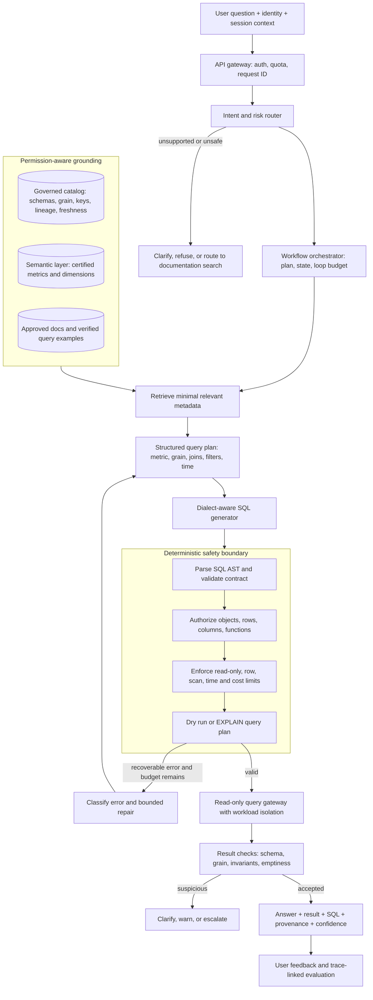
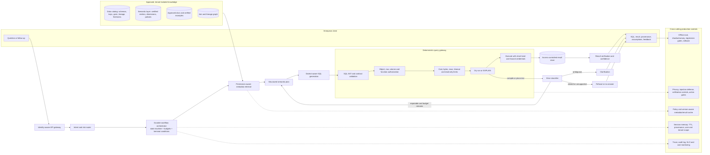

# Mock Problem 16: Design an Agentic Text-to-SQL System

> **Archetype:** enterprise data agent + constrained tool use · **Difficulty:** senior/staff · **Great for:** orchestration, schema reasoning, safe tool execution, permission-aware retrieval, evaluation, and production trade-offs.

## The Prompt
*"Design an agentic text-to-SQL system that lets enterprise users ask natural-language questions over approved data sources, generates and safely executes SQL, repairs recoverable failures, and returns an answer with the SQL, provenance, and confidence."*

Examples:
- "What was net revenue by region last quarter compared with the same quarter last year?"
- "Which enterprise customers expanded usage but opened more severity-one support cases?"
- "Why does this dashboard total differ from the finance report?"

The system serves analysts and non-technical business users across multiple warehouses and must respect tenant, role, row, and column permissions.

## What Core Concept Is the Interviewer Testing?
The interviewer is not mainly testing whether an LLM can write syntactically valid SQL. Modern models can often do that. The real test is whether you can design a **reliable decision-and-tool-use system around an imperfect model**:

1. **Orchestration:** can the agent route, plan, call tools, inspect results, repair failures, and stop without entering an unbounded loop?
2. **Schema reasoning:** can it map ambiguous business language to the correct governed metrics, tables, columns, joins, filters, and grain?
3. **Safe execution:** can generated SQL cross a deterministic validation and authorization boundary before reaching enterprise data?
4. **Grounding and uncertainty:** can it use only approved metadata and data sources, surface conflicts, and return "I cannot answer" when evidence is insufficient?
5. **Production quality:** can you evaluate correctness, prevent regressions, observe traces, and meet latency and cost SLOs?

The strongest thesis is:

> **Treat the LLM as an untrusted planner and SQL proposer, not as the policy engine or database authority. Deterministic controls authorize every tool call and query.**

## Representative Interview Questions

### Question 1: System design
*"Design a production text-to-SQL assistant for a company with thousands of tables across Snowflake, BigQuery, and Postgres. Users have different permissions, and wrong answers can affect financial decisions."*

A strong answer should clarify users and risk, introduce a governed semantic/catalog layer, separate planning from execution, enforce permissions at the data system, and define execution-based evaluation.

### Question 2: Deep-dive scenario
*"The agent generates valid SQL, but it joins `orders` to `order_items` and doubles revenue. It then retries three times after a warehouse timeout. How would your design prevent both failures?"*

A strong answer should discuss table grain and join-cardinality metadata, semantic metrics, AST and query-plan validation, invariant checks, idempotent read-only execution, retry classification, stable request IDs, bounded repair, and human escalation.

## How to Structure the Answer with CHASE
Use the same CHASE framework under interview pressure:

1. **C — Clarify & Scope:** establish users, supported questions, approved sources, permissions, correctness criteria, SLOs, and the read/write boundary.
2. **H — High-Level Design:** present the end-to-end flow from identity-aware routing and metadata retrieval through planning, validation, execution, verification, and response.
3. **A — AI/ML Deep Dive:** explain schema and metric reasoning, typed tool contracts, loop control, repair behavior, memory, conflict handling, and safe no-answer behavior.
4. **S — System & Infrastructure Deep Dive:** cover the query gateway, workload isolation, access enforcement, retries, idempotency, latency, cost, scaling, auditability, and observability.
5. **E — Extensions & Trade-offs:** close with offline and online evaluation, feedback loops, regression handling, guardrails, rollout, and the key autonomy-versus-safety trade-offs.

## 40-Minute Game Plan
| Phase | Focus | Min |
|---|---|---|
| C | Users, source scope, permissions, success and safety boundaries | 6 |
| H | Orchestrator, governed metadata retrieval, validation and execution | 8 |
| A | Tool use + schema reasoning, repair loop, memory and no-answer behavior | 13 |
| S | Isolation, SLOs, retries, cost, observability and scale | 7 |
| E | Evaluation, rollout, feedback, risks and trade-offs | 4 |
| — | Recap | 2 |

---

## C — Clarify & Scope

### Functional requirements
- Accept natural-language analytical questions and relevant conversational context.
- Discover only **approved** databases, tables, views, metrics, and documentation.
- Generate SQL for supported dialects and show the user the proposed query.
- Safely execute read-only queries and return a table/chart-ready result plus a concise explanation.
- Provide **provenance**: source objects, metric definitions, filters, query text, execution time, and freshness.
- Ask a clarification question when business terms, time range, grain, or entity are ambiguous.
- Return a structured no-answer when the required data, permission, or semantic definition is missing.
- Support follow-ups such as "break that down by segment" without silently changing the prior question's constraints.

### Scope boundary
- **In scope:** `SELECT`, approved views/table functions, bounded aggregation, comparison, trend, and diagnostic questions.
- **Out of scope for v1:** arbitrary DDL/DML, stored-procedure invocation, database administration, and autonomous dashboard publication.
- Any future write action is a separate capability requiring explicit confirmation, stronger authorization, idempotency, and approval.

### Users and risk tiers
- Analysts may inspect/edit SQL and query broader governed datasets.
- Business users use certified metrics and curated semantic views by default.
- Finance, healthcare, HR, and security data receive stricter policies and possibly mandatory human review.

### Success criteria
- **Semantic/result correctness**, not merely executable SQL.
- Zero unauthorized data exposure as a hard gate.
- High clarification/no-answer quality when the system lacks evidence.
- p95 interactive response within the agreed SLO, bounded warehouse spend, and complete auditability.

**Tips & suggestions**
- Say early that **execution accuracy is insufficient**: a query can run and still be wrong because of grain, join multiplicity, stale definitions, or omitted filters.
- Establish a read-only v1 and make permissions a hard constraint rather than a ranking metric.
- Clarify whether the product returns SQL only or executes it; execution changes the safety, cost, and observability design.

**Expected interviewer follow-ups**
- *"What is the success metric?"* — Result correctness on representative questions, with semantic equivalence and execution checks; zero unauthorized access is a hard gate.
- *"Would you support writes?"* — Not in v1. If added later, writes use separate tools and credentials, previews, explicit confirmation, idempotency keys, and approval policies.
- *"What happens when 'revenue' has three definitions?"* — Use the governed semantic layer; if context does not select one, present definitions and ask the user rather than guessing.
- *"SQL generation or full question answering?"* — Full read-only analytical flow: understand, generate, validate, execute, verify, and explain with provenance.

## H — High-Level Architecture


### Component responsibilities
- **API gateway:** authenticates the user, assigns a request ID, applies tenant quotas, and passes trusted identity claims.
- **Intent/risk router:** distinguishes data questions, metadata questions, unsupported requests, prompt misuse, and high-risk domains.
- **Workflow orchestrator:** owns the state machine, tool-call budget, retries, fallbacks, checkpoints, and terminal conditions.
- **Grounding layer:** exposes only permission-filtered catalog entries, certified semantics, and approved examples.
- **Planner:** emits a structured intermediate representation before SQL, making assumptions inspectable.
- **SQL generator:** converts the approved plan into the target dialect; it does not grant itself access.
- **Safety boundary/query gateway:** deterministic parser, policy engine, cost guard, dry-run service, and read-only execution credentials.
- **Verifier:** checks whether returned shape, cardinality, units, time range, and domain invariants match the plan.
- **Response composer:** cites metric definitions and source objects, distinguishes facts from interpretations, and reports uncertainty.

**Tips & suggestions**
- Draw **retrieval and authorization as different controls**: catalog retrieval reduces context; the query gateway still enforces real permissions.
- Put a structured logical plan between schema retrieval and SQL generation. It exposes wrong metric/grain/join choices before execution.
- Make the repair arrow return through validation; repaired SQL never bypasses the safety boundary.

**Expected interviewer follow-ups**
- *"Why not send the whole schema to the model?"* — It is too large, expensive, distracting, and potentially sensitive. Retrieve the smallest permission-filtered schema neighborhood relevant to the question.
- *"Where are permissions enforced?"* — At every layer for defense in depth, but the authoritative enforcement is the warehouse/query gateway using the user's effective identity and row/column policies.
- *"Why use an agent at all?"* — Multi-step questions require schema discovery, ambiguity resolution, validation, execution feedback, and bounded repair. A single prompt cannot reliably manage those state transitions.
- *"Why not let the LLM decide whether a query is safe?"* — Safety and authorization require deterministic, testable policies outside the probabilistic model.

## A — AI/ML Deep Dive: Tool Use + Schema Reasoning

### 1. Orchestration and loop control
Represent the workflow as an explicit state machine rather than an unconstrained ReAct loop:

`ROUTE → RETRIEVE → PLAN → GENERATE → VALIDATE → DRY_RUN → EXECUTE → VERIFY → RESPOND`

Each transition records inputs, outputs, latency, token use, policy decisions, and error class. Terminal outcomes are:
- successful answer,
- clarification required,
- safe no-answer,
- policy refusal,
- transient infrastructure failure,
- human/analyst escalation.

Use separate counters for:
- metadata retrieval expansions,
- SQL repair attempts,
- transient tool retries,
- total model/tool calls,
- elapsed time, tokens, and estimated warehouse cost.

Do not retry every failure. Classify it first:
- **Transient:** network timeout or throttling → exponential backoff with jitter; retry the same idempotent request.
- **Repairable model/schema error:** unknown column, dialect mismatch, invalid group-by → provide structured error to the planner; regenerate and revalidate.
- **Ambiguity:** multiple plausible metrics or joins → ask the user.
- **Policy denial:** forbidden source/function/column → do not retry around policy; explain the boundary.
- **Missing/stale evidence:** no approved source or freshness below requirement → no-answer or warn.
- **Budget exhausted:** stop and return traceable failure or escalate.

### 2. Tool contracts
Give every tool a narrow, typed contract. Example tools:

- `search_catalog(query, user_context, source_allowlist, top_k)`  
  Returns object IDs, descriptions, owners, certifications, sensitivity, freshness, and retrieval evidence. It never returns unauthorized metadata.
- `get_schema(object_ids)`  
  Returns columns, types, descriptions, keys, table grain, partitioning, row/column policies, lineage, and safe join edges.
- `get_metric_definition(metric_id)`  
  Returns certified formula, dimensions, default filters, time semantics, owner, version, and effective dates.
- `validate_sql(sql, dialect, user_context, limits)`  
  Returns parsed objects/functions, policy decisions, violations, normalized SQL, and a validation version.
- `dry_run(sql, request_id)`  
  Returns compile errors, estimated bytes/rows/cost, query plan, and warnings; no rows.
- `execute_read_query(sql, request_id, limits)`  
  Returns a result handle and metadata. It runs under read-only, least-privilege credentials and is idempotent by stable request ID.
- `fetch_result(result_handle, page_token)`  
  Returns bounded pages; raw large results do not enter the LLM context.

Tool outputs are data, not instructions. A table comment, sample value, or retrieved document that says "ignore policy" must not change the control flow or privileges.

### 3. Action gating and idempotency
- Metadata reads are low risk but still permission-filtered and audited.
- Dry runs are allowed after SQL validation.
- Read execution is gated by authorization, query class, scan/cost estimate, timeout, and concurrency policy.
- Sensitive result export, dashboard publication, scheduled jobs, and all writes require distinct tools and stronger confirmation/approval.
- Stable request and tool-call IDs deduplicate retries. Query results can be cached by normalized SQL + user/role + policy version + source snapshot, never by SQL alone.
- The orchestrator cannot construct arbitrary connection strings, credentials, or tool names.

### 4. Schema reasoning
The system must reason about more than table and column names:

1. **Entity linking:** map "customers" to the governed customer entity, not whichever table has a similar name.
2. **Metric grounding:** map "net revenue" to a versioned certified formula with exclusions, currency rules, and event-time semantics.
3. **Grain:** know whether a row represents an order, line item, account-day, or subscription-month.
4. **Join path:** use declared primary/foreign keys, relationship cardinality, bridge tables, and temporal validity.
5. **Filter semantics:** add tenant, status, soft-delete, timezone, and effective-date predicates when the semantic definition requires them.
6. **Aggregation:** ensure selected dimensions match grouping and avoid fan-out or double aggregation.
7. **Dialect:** generate correct syntax and functions for Snowflake, BigQuery, Postgres, or the supported engine.
8. **Freshness and lineage:** determine whether sources are current and whether two metrics derive from conflicting pipelines.

Create a structured plan such as:

```text
intent: compare_metric
metric: finance.net_revenue_v3
dimensions: [customer.region]
time_range: previous_fiscal_quarter
comparison: same_fiscal_quarter_previous_year
grain: region_quarter
sources: [certified.finance_order_facts, certified.customer_dim]
join: finance_order_facts.customer_key = customer_dim.customer_key
assumptions: [reporting_currency = USD]
```

Validate this plan against the semantic catalog before rendering SQL.

### 5. Retrieval behavior in enterprise settings
- Retrieve from an allowlisted, tenant-isolated catalog containing approved schemas, metric definitions, lineage, owners, freshness, and verified examples.
- Use hybrid retrieval: lexical matching for table/column/metric names and IDs, semantic retrieval for business language, then graph expansion over safe lineage/join edges.
- Retrieve examples only after schema/metric selection, and prefer verified templates from the same dialect and domain. Examples never override current policy or definitions.
- Apply metadata ACLs before retrieval so even schema names or descriptions are not leaked.

**No-answer handling**
- If no approved source supports the question, say what is missing and suggest an owner or approved next step.
- If the user lacks permission, reveal only the minimum safe explanation; do not expose hidden object names.
- If data is stale, report the freshness timestamp and either ask whether to proceed or refuse based on policy.
- Never manufacture a join, metric definition, or result to maximize answer rate.

**Conflict handling**
- Prefer certified over uncertified assets and current over deprecated versions.
- Respect domain ownership and effective dates.
- If two certified definitions conflict, show the user the safe descriptions, owners, and differences; ask which definition applies.
- Preserve provenance so downstream reviewers can reproduce the decision.

### 6. Memory strategy
**Short-term session memory**
- Stores the current question, resolved entities/metrics, selected time range, assumptions, prior query/result handles, and user corrections.
- Enables follow-ups such as "now group it by industry."
- Has a short TTL, is tenant/user scoped, encrypted, and carries provenance for each remembered value.

**Long-term memory**
- Prefer governed artifacts over free-form model memory: approved query templates, user-saved definitions, organization glossary, and explicit preferences.
- Store a user's preference only with consent and clear ownership; never learn a new enterprise metric merely because one user stated it.
- Do not persist raw result rows, sensitive literals, credentials, or hidden schema content in conversational memory.
- Permission or role changes invalidate affected memory and caches.

Memory risks include stale definitions, cross-tenant leakage, prompt injection persistence, privacy retention violations, and a previous user's assumptions silently contaminating a new query.

### 7. Result verification and explanation
After execution, verify:
- returned columns/types match the plan,
- row count and dimensionality are plausible,
- totals do not violate known reconciliation bounds,
- denominators are non-zero and units/currencies agree,
- result is not empty because a permission filter removed required data,
- sampled or aggregate values satisfy domain invariants,
- the executed SQL hash equals the validated SQL hash.

Verification should not claim mathematical proof. If checks are weak, reduce confidence and expose assumptions. The answer includes:
- concise finding,
- result preview or chart specification,
- executed SQL,
- sources and certified metric versions,
- freshness and filters,
- warnings/assumptions,
- request/query ID for audit.

**Tips & suggestions**
- Spend most deep-dive time on **grain, joins, metric semantics, and authorization**, not prompt wording.
- Separate **retry** from **repair**: retry preserves an idempotent call after transient failure; repair changes the plan or SQL and must pass validation again.
- Say that tool outputs and database metadata are untrusted data. This directly addresses indirect prompt injection.
- Prefer governed long-term memory over opaque personalized memory for enterprise facts.

**Expected interviewer follow-ups**
- *"How do you prevent the revenue double-counting join?"* — Store grain and relationship cardinality in the catalog, generate an explicit join plan, detect many-to-many fan-out in AST/query-plan validation, and run aggregate invariants before presenting the result.
- *"The SQL fails with an unknown column. What happens?"* — Classify it as repairable, return a structured error plus relevant schema to the planner, regenerate once within budget, and run the full safety pipeline again.
- *"How do follow-up questions work?"* — Session memory carries provenance-linked metric, dimensions, filters, and result handles; the planner produces a delta while restating inherited assumptions.
- *"Can the agent learn from a user's corrected metric definition?"* — Use it within the session; persist only through an explicit governed workflow with ownership/review, not automatic long-term memory.
- *"What if no approved source answers the question?"* — Return a no-answer with the missing evidence or access boundary; never fall back to an unapproved warehouse or invent SQL.

## S — System & Infrastructure Deep Dive

### Query gateway and isolation
- Execute through a central query gateway, never direct model-to-database connections.
- Use short-lived, least-privilege credentials bound to the effective user/role and tenant.
- Enforce read-only transactions, statement allowlists, row/column security, masking, query timeout, maximum rows, bytes scanned, and cost.
- Route agent workloads to isolated warehouse pools/resource groups so a bad analytical query cannot starve production.
- Paginate/store large results in an access-controlled result service; send only bounded summaries to the LLM.

### Reliability and retries
- Persist workflow state and tool-call records so requests can resume without re-executing completed queries.
- Use circuit breakers and per-tool timeouts.
- Retry only idempotent operations automatically; use exponential backoff with jitter for throttling/transient network failures.
- The same execution `request_id` returns the existing result handle rather than rerunning the warehouse query.
- Bound repair iterations and schema expansions; escalate or ask for clarification instead of looping.

### Latency and cost
An illustrative p95 budget:
- routing + policy precheck: 100 ms,
- metadata retrieval: 300–700 ms,
- planning + SQL generation: 1–2 s,
- validation + dry run: 300 ms–2 s,
- warehouse execution: 1–8 s,
- verification + response: 500 ms–1.5 s.

Production levers:
- Route simple templates/metadata questions to a smaller model; reserve a stronger model for ambiguous multi-table planning or repair.
- Run independent metadata retrievals in parallel, but preserve dependencies between plan, validation, and execution.
- Cache permission-safe catalog fragments, embeddings, metric definitions, and validated templates with policy/version-aware keys.
- Use compact schema cards rather than raw DDL for thousands of tables.
- Cap retrieved objects, examples, tokens, tool calls, bytes scanned, rows, and wall-clock time.
- Stream status and partial explanation, not unvalidated query results.
- Prefer a clarification question over an expensive speculative fan-out.

### Observability
Trace every workflow with:
- route and risk class,
- retrieved object IDs and versions,
- structured plan and SQL revisions,
- model/tool versions and latency,
- validation and authorization decisions,
- dry-run estimate versus actual bytes/cost,
- retry/repair reason and count,
- executed SQL hash, result shape, confidence, and terminal outcome,
- user feedback linked to the exact trace.

Monitor:
- success, clarification, refusal, and no-answer rates,
- syntax/compile and execution failure rates,
- repair success and loop-budget exhaustion,
- policy blocks and attempted unauthorized access,
- empty/suspicious result rates,
- p50/p95/p99 latency by stage,
- tokens, model calls, warehouse bytes/cost per answered question,
- drift by domain, dialect, user cohort, and schema version.

Audit logs must be append-only/tamper-evident, access-controlled, retention-limited, and searchable by request ID without exposing unnecessary result data.

**Tips & suggestions**
- Make the **query gateway** the only execution path; this centralizes authorization, workload isolation, and auditing.
- Give concrete budgets for model calls, repair iterations, bytes scanned, and wall time.
- Distinguish model latency from warehouse latency; they need different optimizations and owners.

**Expected interviewer follow-ups**
- *"How do you stop a generated query from scanning petabytes?"* — Dry-run cost estimation, partition/filter rules, bytes/cost caps, timeout, and an isolated workload pool; ask for confirmation or refuse above policy.
- *"How do you retry a warehouse timeout without charging twice?"* — Stable request ID, idempotent read execution, durable tool state, and result-handle deduplication.
- *"How do you scale to thousands of schemas?"* — Permission-aware hybrid metadata retrieval plus graph expansion; compact schema cards and tenant/domain sharding, never whole-schema prompting.
- *"What do you alert on?"* — Safety-policy violations, correctness-regression proxies, repair/loop spikes, latency SLO burn, schema freshness failures, and cost anomalies.

## E — Extensions, Evaluation & Trade-offs

### Offline evaluation
Build a versioned test set stratified by domain, difficulty, dialect, schema size, ambiguity, permission profile, and adversarial input. Include:
- single-table and multi-join questions,
- metric/grain/time-semantics traps,
- unanswerable and conflicting-definition cases,
- row/column access scenarios,
- malicious prompts and poisoned metadata,
- schema migrations and deprecated assets,
- warehouse errors and timeout scenarios.

Measure:
- **result accuracy** against golden or invariant-checked results,
- **semantic equivalence** when multiple SQL strings are valid,
- execution/compile rate and clause-level accuracy,
- correct tables, joins, metrics, filters, grain, and time range,
- clarification precision/recall and no-answer correctness,
- unauthorized-access and unsafe-query rate as hard gates,
- repair success without policy bypass,
- latency, tokens, calls, bytes scanned, and cost.

String match is a weak metric. Prefer execution against frozen test databases, result equivalence, metamorphic tests, and domain invariants. Human experts review ambiguous/high-risk cases.

### Online evaluation and feedback
- Roll out through shadow mode → internal analysts → small canary → domain-by-domain expansion.
- Track task completion, accepted/copied SQL, edits before execution, rerun rate, abandonment, clarification success, analyst-rated correctness, incident rate, latency, and cost.
- Use explicit "correct/incorrect" feedback plus reason categories; do not treat clicks alone as correctness.
- Sample traces for expert review, especially financial/high-risk domains.
- Feed confirmed failures into a replayable regression set. Promote new prompts/models/retrievers only when safety gates pass and quality/cost do not regress beyond thresholds.
- Support rapid rollback of model, prompt, catalog, validator, and semantic-layer versions independently.

### Guardrails and threat model
- **Prompt misuse:** classify jailbreaks and attempts to enumerate hidden schemas, bypass limits, or invoke writes; retrieved metadata is untrusted.
- **Privacy boundaries:** tenant isolation, purpose limitation, data minimization, encryption, retention/deletion controls, and redaction of sensitive literals from prompts/logs.
- **Access control:** authoritative warehouse enforcement with short-lived user-bound credentials; metadata and result access use the same effective policy.
- **Auditability:** trace every source, plan, SQL revision, policy decision, execution identity, and returned result handle.
- **Exfiltration:** block unsafe functions, external stages/UDFs, network access, comments/instructions from metadata, and oversized result extraction.
- **Action gating:** separate read, export/share, schedule, and write tools; increasing consequence requires increasing user confirmation and approval.

### Key trade-offs
- **Autonomy vs. safety:** more automatic repair raises answer rate but increases loop, cost, and policy-bypass risk; keep repairs bounded and revalidate.
- **Freshness vs. cache hit rate:** cache metadata for speed, but invalidate on schema, policy, metric, or ownership changes.
- **Full schema context vs. focused retrieval:** broad context improves recall but hurts cost, privacy, and model attention.
- **Strict grounding vs. answer rate:** no-answer reduces coverage but protects trust; optimize measured no-answer correctness, not raw completion.
- **Powerful credentials vs. least privilege:** user-bound access may produce fewer answers, but service-account superuser access is unacceptable.
- **Single large model vs. routed workflow:** one model is simpler; routing smaller models/templates for easy steps lowers cost and latency but adds orchestration complexity.

**Tips & suggestions**
- Lead evaluation with **result correctness and zero unauthorized access**, then add latency/cost. SQL syntax rate is only a diagnostic.
- Explain how confirmed online failures become replayable offline regressions and deployment gates.
- Treat clarification and no-answer as desirable outcomes when uncertainty is real, not as universal failures.

**Expected interviewer follow-ups**
- *"How do you evaluate when many SQL queries are equivalent?"* — Execute against a frozen database and compare normalized results; add semantic plan checks, metamorphic tests, and invariants rather than exact SQL match.
- *"How do you catch regressions after a schema change?"* — Versioned catalogs and schemas, replay suites by domain/dialect, shadow traffic, migration-triggered tests, canary rollout, and independent rollback.
- *"Can user feedback train the model directly?"* — Not blindly. Link feedback to traces, verify labels, protect sensitive data, curate a regression/training set, and pass offline safety/quality gates.
- *"What is the worst failure?"* — Unauthorized disclosure or a confidently wrong high-impact answer. Both require hard controls, provenance, and incident-ready traces.

## What Interviewers Look For
- **System design clarity and correctness:** a legible state machine with explicit trust boundaries, typed tools, deterministic validation, and authoritative data-layer permissions.
- **Schema reasoning depth:** grain, join cardinality, metric definitions, temporal semantics, lineage, and conflict handling—not just vector search over DDL.
- **Trade-off analysis:** autonomy versus safety, context recall versus cost/privacy, freshness versus caching, and model quality versus latency.
- **Failure handling:** a taxonomy that distinguishes retry, repair, clarification, refusal, no-answer, and escalation; bounded loops and idempotent tools.
- **Evaluation maturity:** execution/result-based offline tests, safety hard gates, online outcome metrics, trace review, and regression-driven rollout.
- **Practical production awareness:** workload isolation, scan limits, dialect differences, schema change, audit retention, user-bound credentials, SLOs, and per-query cost.
- **Communication:** clear assumptions, prioritized depth, and explicit statements about what the system will not do.

## Sample Strong Answer Outline
1. **Frame the challenge:** "This is a governed data agent, not a SQL autocomplete feature. Correctness, permissions, and safe execution dominate."
2. **Clarify:** users, warehouses, supported analytical questions, execution versus generation, write boundary, risk tiers, SLO, and correctness definition.
3. **State the design:** permission-aware metadata retrieval → structured semantic plan → dialect SQL → deterministic AST/auth/cost validation → dry run → read-only execution → result verification → cited answer.
4. **Deep-dive:** explain metric/entity grounding, grain, cardinality-safe joins, temporal filters, approved examples, and conflict/no-answer behavior.
5. **Explain orchestration:** explicit state machine, typed tools, error taxonomy, idempotent retries, bounded repair, and terminal conditions.
6. **Cover memory:** short-lived provenance-linked session state; governed, consented long-term artifacts; no raw sensitive result persistence.
7. **Secure it:** user-bound credentials, row/column policy, tenant isolation, action gates, untrusted tool output, audit trail, and exfiltration controls.
8. **Productionize:** model routing, compact context, policy-versioned caching, dry-run scan caps, workload isolation, trace metrics, and SLO budgets.
9. **Evaluate and ship:** execution/result equivalence, adversarial permission tests, clarification/no-answer quality, shadow/canary rollout, feedback-to-regression loop, and rollback.
10. **Close with trade-offs:** bounded autonomy, strict grounding, and least privilege may reduce answer rate, but preserve trust.

## Common Mistakes & How to Avoid Them

### Mistake 1: Treating valid SQL as correct SQL
**Why it fails:** syntactically valid SQL can use the wrong revenue definition, duplicate rows through a many-to-many join, apply the wrong timezone, or omit a required status filter.

**Correction:** reason through a structured semantic plan with metric version, grain, join cardinality, filters, and time semantics; verify results with invariants.

### Mistake 2: Giving the LLM direct database access
**Why it fails:** prompts and retrieved metadata are untrusted, the model is probabilistic, and a service-account credential can bypass user permissions.

**Correction:** route every query through deterministic AST/policy validation and a read-only query gateway using short-lived user-bound credentials, scan limits, and audit logs.

### Mistake 3: Retrying everything in an open-ended agent loop
**Why it fails:** policy denials should never be retried, ambiguity requires a user, and repeated execution can multiply warehouse cost.

**Correction:** classify errors; use idempotent retries only for transient failures, bounded repair for correctable SQL, clarification for ambiguity, and terminal refusal/no-answer/escalation states.

### Mistake 4: Sending the entire enterprise schema to the model
**Why it fails:** it increases token cost and latency, distracts the model, and may leak sensitive metadata.

**Correction:** retrieve the smallest permission-filtered set of certified metrics, schema cards, and join neighbors; expand only when evidence warrants it.

### Mistake 5: Ignoring no-answer, conflicts, and evaluation
**Why it fails:** enterprise metadata is incomplete and contradictory. Optimizing only answer rate rewards confident fabrication and hides regressions.

**Correction:** design clarification/conflict/no-answer paths, return provenance, and evaluate result correctness, safety, uncertainty behavior, latency, and cost with replayable regression suites.

## Final Architecture


## 60-Second Close
"I would design this as a governed, read-only data agent rather than a one-shot SQL generator. An identity-aware orchestrator retrieves only approved metadata and certified metrics, builds an inspectable plan containing metric, grain, joins, filters, and time semantics, and generates dialect-specific SQL. Every proposal crosses a deterministic query gateway for AST validation, user-bound authorization, row/column policy, scan and cost limits, and a dry run before isolated execution. The agent classifies failures: transient calls retry idempotently, repairable SQL goes through a bounded replan-and-revalidate loop, ambiguity triggers clarification, and missing or denied evidence yields a safe no-answer. Session memory is short-lived and provenance-linked; long-term knowledge is governed. I would evaluate result equivalence and domain invariants—not string match—with zero unauthorized access as a hard gate, then shadow and canary by domain while monitoring correctness proxies, repairs, latency, tokens, warehouse cost, and complete audit traces."
